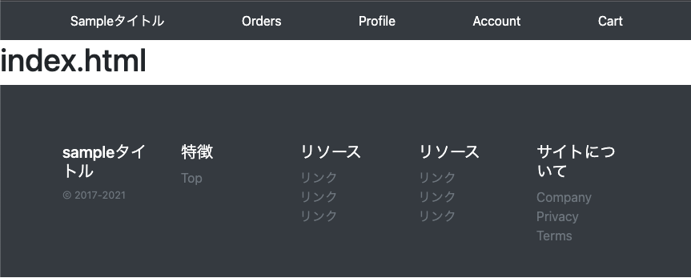
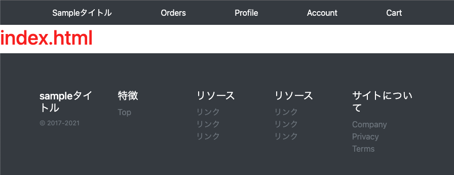
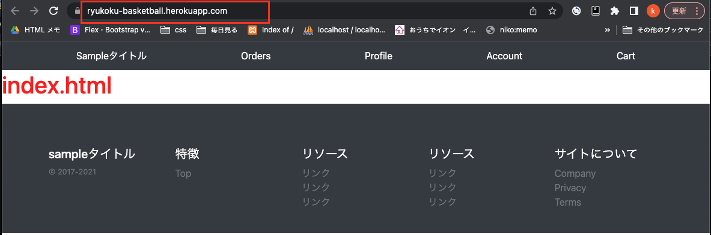

<!-- omit in toc -->
# Django Herokuにデプロイまで


- [Djangoのインストール](#djangoのインストール)
- [データベースにPostgreSQL/pgAdminを追加](#データベースにpostgresqlpgadminを追加)
- [マイグレートして管理者を作成](#マイグレートして管理者を作成)
- [サーバーを立ち上げ、管理者画面へログイン](#サーバーを立ち上げ管理者画面へログイン)
- [SECRET_KEYなどの機密情報を別ファイルで管理](#secret_keyなどの機密情報を別ファイルで管理)
- [Gitの管理対象外のファイルを記します](#gitの管理対象外のファイルを記します)
- [環境設定](#環境設定)
- [テンプレートファイルの作成](#テンプレートファイルの作成)
  - [templates/base.html　メインのテンプレートファイル<br>](#templatesbasehtmlメインのテンプレートファイル)
- [トップページへのルーティング](#トップページへのルーティング)
  - [viewの設定](#viewの設定)
- [cssの適用](#cssの適用)
- [GitとGithubの登録](#gitとgithubの登録)
- [Herokuへデプロイしアプリを公開](#herokuへデプロイしアプリを公開)

# Djangoのインストール
configプロジェクトとbaseアプリの作成

```python
basketball-tube % python3 -m venv myvenv
basketball-tube % source myvenv/bin/activate
(myvenv) basketball-tube % python3 -V
Python 3.10.7
(myvenv) basketball-tube % pip install django
Successfully installed asgiref-3.5.2 django-4.1.1 sqlparse-0.4.3
(myvenv) basketball-tube % django-admin startproject config .
(myvenv) basketball-tube % python manage.py startapp base
```

# データベースにPostgreSQL/pgAdminを追加
参考：/Users/niko/Desktop/MyApp/study/python/opencv/08_データベースにPostgreSQL_pgAdminを追加.md

```
(myvenv) basketball-tube % psql postgres
psql (14.5 (Homebrew))
Type "help" for help.

postgres=# CREATE DATABASE db_basketball_tube;
CREATE DATABASE
postgres=# CREATE USER user_basketball_tube WITH PASSWORD 'password_basket';
CREATE ROLE
postgres=# ALTER ROLE user_basketball_tube SET client_encoding TO 'utf8';
ALTER ROLE
postgres=# ALTER ROLE user_basketball_tube SET default_transaction_isolation TO 'read committed';
ALTER ROLE
postgres=# ALTER ROLE user_basketball_tube SET timezone TO 'Asia/Tokyo';
ALTER ROLE
postgres=# GRANT ALL PRIVILEGES ON DATABASE db_basketball_tube TO user_basketball_tube;
GRANT
postgres=# \q
```


```python
# 先程作成したユーザー、データベースへアクセス
(myvenv) basketball-tube % psql -U user_basketball_tube -d db_basketball_tube
psql (14.5 (Homebrew))
Type "help" for help.
# これが出て来ればOK
db_basketball_tube=>
```


DjangoでpostgreSQLを扱うのに必要なパッケージをインストール

```python
(myvenv) basketball-tube % pip install psycopg2-binary
```


settings.pyの書き換え

```python
# DATABASES = {
#     'default': {
#         'ENGINE': 'django.db.backends.sqlite3',
#         'NAME': os.path.join(BASE_DIR, 'db.sqlite3'),
#     }
# }

DATABASES = {
    'default': {
        'ENGINE': 'django.db.backends.postgresql_psycopg2',
        'NAME': 'db_basketball_tube',
        'USER': 'user_basketball_tube',
        'PASSWORD': 'password_basket',
        'HOST': 'localhost',
        'PORT': '5432',
    }
}
```

# マイグレートして管理者を作成

```python
(myvenv) basketball-tube % python manage.py makemigrations
(myvenv) basketball-tube % python manage.py migrate
(myvenv) basketball-tube % python manage.py createsuperuser
Username (leave blank to use 'niko'): matsuo
Email address: matsuokuniko7@gmail.com
Password:
Password (again):
Superuser created successfully.
```

# サーバーを立ち上げ、管理者画面へログイン

```python
(myvenv) basketball-tube % python manage.py runserver
```

`http://127.0.0.1:8000/`へアクセス<br>
Djangoのページが開く。`/admin`を後につけると管理画面に入れる<br>
Username: matsuo<br>
Password:<br>
`CONTROL-C`でサーバーを落とす

# SECRET_KEYなどの機密情報を別ファイルで管理
参考：/Users/niko/Desktop/MyApp/study/python/01_memo/Django/memo/03_SECRET_KEYなどの機密情報を別ファイルで管理.md<br>

1.settings.py<br>
2.settings_local.py　作成　機密情報専用の設定ファイル<br>
3.settings_local_sample.py　作成　Gitの管理対象外の値の定義を記すファイル<br>
<br>

- config/settings_local.py　settings.pyと同じ階層

```python
# Djangoの秘密キー
SECRET_KEY = 'w$3rdv$15&p#(%tual8(gs)l2sxg5)-$9z54ge0h+i4-qmr@l='
# DB接続情報
DATABASES = {
    'default': {
        'ENGINE': 'django.db.backends.postgresql_psycopg2',
        'NAME': 'db_basketball_tube',
        'USER': 'user_basketball_tube',
        'PASSWORD': 'password_basket',
        'HOST': 'localhost',
        'PORT': '5432',
    }
}
```

- config/settings.py

```python
from .settings_local import * # 追加
import os

# SECRET_KEY = '' # コメントアウト

DATABASES = { # 修正
    'default': {
    }
}
```

- config/settings_local_sample.py　settings.pyと同じ階層

```python
# Djangoの秘密キー
SECRET_KEY = ''
# DB接続情報
DATABASES = {
    'default': {
    }
}
```

# Gitの管理対象外のファイルを記します
`.gitignore`ファイルの作成　manage.pyと同じ階層

```
settings_local.py
memo
```

# 環境設定
templatesフォルダ、staticフォルダの作成

```python
(myvenv) % mkdir templates
(myvenv) % mkdir static
```

config/settings.py

```python
from .settings_local import *
import os
from pathlib import Path # 追加

# BASE_DIR = os.path.dirname(os.path.dirname(os.path.abspath(__file__))) # コメントアウト
BASE_DIR = Path(__file__).resolve().parent.parent # 追加

INSTALLED_APPS = [
    ...
    'base',
]

TEMPLATES = [
    {
        'BACKEND': 'django.template.backends.django.DjangoTemplates',
        'DIRS': [BASE_DIR / 'templates'], #追加
        'APP_DIRS': True,
        'OPTIONS': {
            'context_processors': [
                'django.template.context_processors.debug',
                'django.template.context_processors.request',
                'django.contrib.auth.context_processors.auth',
                'django.contrib.messages.context_processors.messages',
            ],
        },
    },
]

...
LANGUAGE_CODE = 'ja' #変更

TIME_ZONE = 'Asia/Tokyo' #変更

...
STATIC_URL = '/static/'

STATICFILES_DIRS = [BASE_DIR / 'static'] #追加

```

# テンプレートファイルの作成
templates<br>
├── pages<br>
│   └── index.html<br>
├── snippets<br>
│   ├── footer.html<br>
│   └── header.html<br>
└── base.html

```python
(myvenv) basketball-tube % cd templates
(myvenv) templates % touch base.html
(myvenv) templates % mkdir pages
(myvenv) templates % mkdir snippets
(myvenv) templates % cd snippets
(myvenv) snippets % touch footer.html
(myvenv) snippets % touch header.html
(myvenv) snippets % cd ../
(myvenv) templates % cd pages
(myvenv) pages % touch index.html
(myvenv) pages % cd ../
(myvenv) templates % cd ../
(myvenv) basketball-tube %
```

## templates/base.html　メインのテンプレートファイル<br>
BootstrapのCDNではなくインストールやり方もある。書き方が特殊になるので、今回はCDNで行う<br>memo/01-1_Bootstrap.mdにあり。

```html
<!DOCTYPE html>
<html lang="ja">

<head>
  <meta charset="UTF-8">
  <meta http-equiv="X-UA-Compatible" content="IE=edge">
  <meta name="viewport" content="width=device-width, initial-scale=1.0">
  <title>sampleタイトル</title>
  <!-- Bootstrap 4.5.0 -->
  <link rel="stylesheet" href="https://stackpath.bootstrapcdn.com/bootstrap/4.5.0/css/bootstrap.min.css" integrity="sha384-9aIt2nRpC12Uk9gS9baDl411NQApFmC26EwAOH8WgZl5MYYxFfc+NcPb1dKGj7Sk" crossorigin="anonymous">
</head>

<body>
  <header>
    
    
    
  </header>

  <main>
    
    
  </main>

  <footer>
    
    
    
  </footer>

</body>

</html>
```

templates/snippets/header.html<br>

```html
<div class="py-1 bg-dark ">
  <nav class="container d-flex flex-column flex-md-row justify-content-between">
    <a class="py-2 text-white" href="/"> Sampleタイトル</a>
    <a class="py-2 d-none d-md-inline-block text-white" href="/orders/">Orders</a>
    <a class="py-2 d-none d-md-inline-block text-white" href="/profile/">Profile</a>
    <a class="py-2 d-none d-md-inline-block text-white" href="/account/">Account</a>
    <a class="py-2 d-none d-md-inline-block text-white" href="/cart/">Cart</a>
  </nav>
</div>
```

templates/snippets/footer.html<br>

```html
<div class="container w-100 bg-dark text-white py-4" style="max-width: 100%;">
  <div class="row mt-5 mx-5">
    <div class="col-12 col-md">
      <h5>sampleタイトル</h5>
      <small class="d-block mb-3 text-muted">&copy; 2017-2021</small>
    </div>
    <div class="col-6 col-md">
      <h5>特徴</h5>
      <ul class="list-unstyled text-small ">
        <li><a class="link-secondary text-muted" href="/">Top</a></li>
      </ul>
    </div>
    <div class="col-6 col-md">
      <h5>リソース</h5>
      <ul class="list-unstyled text-small">
        <li><a class="link-secondary text-muted" href="#">リンク</a></li>
        <li><a class="link-secondary text-muted" href="#">リンク</a></li>
        <li><a class="link-secondary text-muted" href="#">リンク</a></li>
      </ul>
    </div>
    <div class="col-6 col-md">
      <h5>リソース</h5>
      <ul class="list-unstyled text-small">
        <li><a class="link-secondary text-muted" href="#">リンク</a></li>
        <li><a class="link-secondary text-muted" href="#">リンク</a></li>
        <li><a class="link-secondary text-muted" href="#">リンク</a></li>
      </ul>
    </div>
    <div class="col-6 col-md">
      <h5>サイトについて</h5>
      <ul class="list-unstyled text-small">
        <li><a class="link-secondary text-muted" href="#">Company</a></li>
        <li><a class="link-secondary text-muted" href="#">Privacy</a></li>
        <li><a class="link-secondary text-muted" href="#">Terms</a></li>
      </ul>
    </div>
  </div>
</div>
```

templates/pages/index.html<br>

```html




<h1>index.html</h1>


```


# トップページへのルーティング
## viewの設定
viewが増えてくると一つのファイルでは見にくいので、フォルダで管理<br>
`最初にあったviews.pyは削除`する　__pycache__はいつの間にかできる<br>

base<br>
├── views　作成<br>
│   ├── __ pycache __<br>
│   ├── __ init __.py　作成<br>
│   └── item_views.py　作成<br>
└── views.py　<-------------これは削除する<br>

```python
(myvenv) basketball-tube % cd base
(myvenv) base % mkdir views
(myvenv) base % cd views
(myvenv) views % touch __init__.py
(myvenv) views % touch item_views.py
(myvenv) views % cd ../
(myvenv) base % cd ../
(myvenv) basketball-tube %
```

base/views/__ init __.py

```python
from .item_views import *
```

base/views/item_views.py

```python
from django.shortcuts import render


def index(request):
    return render(request, 'pages/index.html')
```

トップページが表示された


# cssの適用
static
└── css　作成<br>
    └── style.css　作成<br>

Bootstrapがずれるので、不要
 ~~ * 追記 下記ファイルもここで追加しておく ~~ <br>
 ~~ - static/css/reset.css ~~
 ~~ - static/css/sanitize.css ~~

static/css/style.css

```css
h1 {
  color: red;
}
```

templates/base.html<br>
``<br>
`<link rel="stylesheet" href="">`

```html
 <!-- 追加 -->
<!DOCTYPE html>
<html lang="ja">

<head>
  ...
  <link rel="stylesheet" href=""> <!-- 追加 -->
</head>

<body>
...
</body>

</html>
```

cssで色が変わっているのを確認


# GitとGithubの登録
省略


# Herokuへデプロイしアプリを公開
参考：/Users/niko/Desktop/MyApp/study/python/01_memo/Django/memo/06_Herokuへデプロイしアプリを公開.md

```python
(myvenv) basketball-tube % pip install django-heroku gunicorn whitenoise
(myvenv) basketball-tube % pip freeze > requirements.txt
(myvenv) basketball-tube % python --version
Python 3.10.7
(myvenv) basketball-tube % echo "web: gunicorn config.wsgi --log-file -" > Procfile
(myvenv) basketball-tube % echo python-3.10.7 > runtime.txt
```

config/settings_local.py

```python
DEBUG = True # 1行目に追加
```

config/settings.py

```Python
- from .settings_local import * # 削除

- DEBUG = True  # 削除
+ DEBUG = False # 追加

...
# 一番最後に追加
DEBUG = False

try:
    # 存在する場合、ローカルの設定読み込み
    from .settings_local import *
except ImportError:
    pass

if not DEBUG:
    # Heroku settings

    # staticの設定
    import os
    import django_heroku

    # BASE_DIR = os.path.dirname(os.path.dirname(os.path.abspath(__file__)))
    BASE_DIR = Path(__file__).resolve().parent.parent # 追加

    # Static files (CSS, JavaScript, Images)
    STATIC_ROOT = os.path.join(BASE_DIR, 'staticfiles')
    STATIC_URL = '/static/'

    # Extra places for collectstatic to find static files.
    STATICFILES_DIRS = (
        os.path.join(BASE_DIR, 'static'),
    )

    MIDDLEWARE += [
        'whitenoise.middleware.WhiteNoiseMiddleware',
    ]

    # HerokuのConfigを読み込み
    django_heroku.settings(locals())
```

```python
(myvenv) basketball-tube % mkdir staticfiles
(myvenv) basketball-tube % cd staticfiles
(myvenv) staticfiles % touch .gitkeep
(myvenv) staticfiles % cd ../
(myvenv) basketball-tube %
```

```python
(myvenv) basketball-tube % git add .
(myvenv) basketball-tube % git commit -m"heroku settings"
(myvenv) basketball-tube % git push origin master
```

```python
(myvenv) basketball-tube % heroku login
heroku: Press any key to open up the browser to login or q to exit:
Opening browser to https://cli-auth.heroku.com/auth/cli/browser/ba19a8b1-d0aa-4160-a97d-351db0876520?requestor=SFMyNTY.g2gDbQAAAA0xMjYuMjA3LjI3LjQ2bgYAKNvGfoMBYgABUYA.V9r8KzDike7P2pGx8Y0YwyJtsrioGpFjjbv5hGUZ0M4
Logging in... done
Logged in as matsuokuniko7@gmail.com

(myvenv) basketball-tube % heroku create ryukoku-basketball
Creating ⬢ ryukoku-basketball... done
https://ryukoku-basketball.herokuapp.com/ | https://git.heroku.com/ryukoku-basketball.git

(myvenv) basketball-tube % heroku config:set SECRET_KEY='w$3rdv$15&p#(%tual8(gs)l2sxg5)-$9z54ge0h+i4-qmr@l='
Setting SECRET_KEY and restarting ⬢ ryukoku-basketball... done, v3
SECRET_KEY: w$3rdv$15&p#(%tual8(gs)l2sxg5)-$9z54ge0h+i4-qmr@l=

(myvenv) basketball-tube % git push heroku master
```

herokuにデプロイできた
[https://ryukoku-basketball.herokuapp.com/](https://ryukoku-basketball.herokuapp.com/)



herokuにPostgreSQLを適用させることと、マイグレートやcreatesuperuserは次回アイテムモデル作成後