<!-- omit in toc -->
# モデル定義（Itemモデル:動画）

Itemモデル（動画テーブル）を作り、index.htmlに一覧で表示する<br><br>

完成図<br>
index.htmlにItemの一覧が表示されている
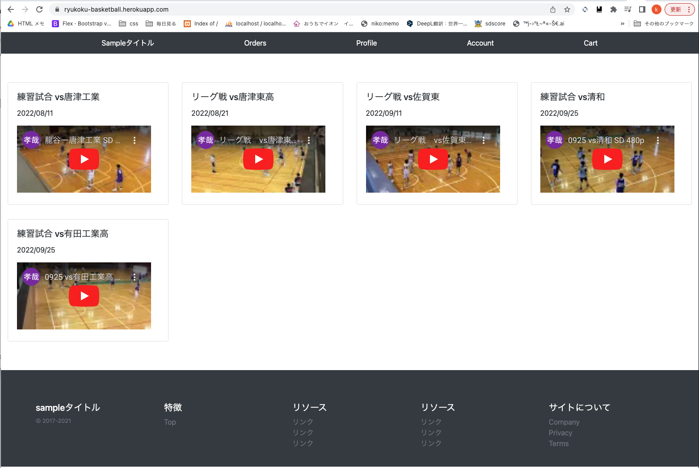


- [modelの設定](#modelの設定)
  - [base/models/__init__.py](#basemodelsinitpy)
  - [base/models/item_models.py](#basemodelsitem_modelspy)
    - [エラー対応:norderedObjectListWarning](#エラー対応norderedobjectlistwarning)
  - [マイグレーション](#マイグレーション)
- [モデルを管理画面に反映](#モデルを管理画面に反映)
- [base/admin.py-1](#baseadminpy-1)
- [base/admin.py-2](#baseadminpy-2)
- [index.htmlの修正](#indexhtmlの修正)
- [base/views/item_views.py](#baseviewsitem_viewspy)
- [config/urls.py](#configurlspy)
  - [登録アイテムが3つとも一覧で表示されているのを確認<br>](#登録アイテムが3つとも一覧で表示されているのを確認)
- [トップページの修正](#トップページの修正)
  - [templates](#templates)
  - [templates/pages/index.html](#templatespagesindexhtml)
  - [templates/snippets/item_box.html](#templatessnippetsitem_boxhtml)
- [サーバーを立ち上げ外面を確認](#サーバーを立ち上げ外面を確認)
- [git push, herokuのデータベースを反映させる](#git-push-herokuのデータベースを反映させる)
  - [config/settings.py](#configsettingspy)
- [https://ryukoku-basketball.herokuapp.com/ へアクセス](#httpsryukoku-basketballherokuappcom-へアクセス)
  - [admin画面に入りitemを追加する](#admin画面に入りitemを追加する)
  - [index.htmlにItemの一覧が表示されているのを確認　OK!](#indexhtmlにitemの一覧が表示されているのを確認ok)
- [この後は、'08_タグの表示'をする、その後03をする](#この後は08_タグの表示をするその後03をする)

<br><br>

## modelの設定
modelが増えてくると一つのファイルでは見にくいので、フォルダで管理<br>
`models.pyは削除`する　__pycache__はいつの間にかできる<br>

base<br>
├── models　作成<br>
│   ├── __ pycache __<br>
│   ├── __ init __.py　作成<br>
│   └── item_models.py　作成<br>
└── models.py　<-------------これは削除する<br>

### base/models/__init__.py
```python
from .item_models import *
# modelsを呼び出せば、item_models.pyも呼び出せる
```

### base/models/item_models.py
```python
from django.db import models
from django.utils.crypto import get_random_string #ランダム文字列作成 id用


def create_id():
    return get_random_string(22) # 22文字のランダムな文字列を作る
# idをランダムにすると、ユーザーに予測がされにくくい


class Tag(models.Model):
    slug = models.CharField(max_length=32, primary_key=True) # slug:id
    name = models.CharField(max_length=32)

    def __str__(self):
        return self.name


class Item(models.Model):
		# default=create_id 関数を呼び出す
		# editable=False 修正不可(管理画面でも)
    id = models.CharField(default=create_id, primary_key=True, max_length=22, editable=False)
    title = models.CharField(default='', max_length=200)
        # PositiveIntegerField 正の整数
    description = models.TextField(default='', blank=True) # 説明(詳細)
    created_at = models.DateTimeField(auto_now_add=True) # 作成日 自動作成
    updated_at = models.DateTimeField(auto_now=True) ## 更新日 自動作成
    youtube_url = models.CharField(default='', max_length=200)
    # ManyToManyField	多対多
    tags = models.ManyToManyField(Tag) # タグは複数付けれるので複数形

    class Meta:
        ordering = ['-updated_at'] # 更新順

    def __str__(self):
        return self.title
```

#### エラー対応:norderedObjectListWarning
```python
norderedObjectListWarning: Pagination may yield inconsistent results with an unordered object_list:<class 'base.models.item_models.Item'> QuerySet.
```
このエラーはインスタンスのリストの並び順が固定されいなく、フワフワしているためページネーションでうまくオブジェクトを表示することができない

- [参考url: UnorderedObjectListWarning](https://stackoverflow.com/questions/44033670/python-django-rest-framework-unorderedobjectlistwarning/44036414)
- [参考url: DjangoのMetaクラスの使い方](https://yu-nix.com/archives/django-meta/)
- [参考url: Metaクラスとは何なのでしょうか？](https://teratail.com/questions/87695)

Metaクラス(class文の持つ定義する機能」を定義する機能)を使って、Itemモデルに順番をつけることで解決する
```python
class Meta:
    ordering = ['-updated_at']
```


### マイグレーション
```python
(myvenv) basketball-tube % python manage.py makemigrations base
Migrations for 'base':
  base/migrations/0001_initial.py
    - Create model Tag
    - Create model Item
(myvenv) basketball-tube % python manage.py migrate
```

もしエラー`ImproperlyConfigured("Error loading psycopg2 module: %s" % e)`が出たら、<br>
[参考url:psycopg2.extensionsが見つからない時の対処法](https://qiita.com/Gilfeather/items/23cd3a2446b74ad1cd1b)<br>
psycopg2-binaryを強制的に再インストールすることで解決

```python
# エラーが出たときの対応
(myvenv) basketball-tube % pip install --upgrade wheel
(myvenv) basketball-tube % pip install --upgrade setuptools
(myvenv) basketball-tube % pip install psycopg2-binary --force-reinstall --no-cache-dir
# makemigrationsする
(myvenv) basketball-tube % python manage.py makemigrations base
(myvenv) basketball-tube % python manage.py migrate
```

<br><br>

## モデルを管理画面に反映
サーバーを立ち上げてみる

```python
(myvenv) basketball-tube % python manage.py runserver
```

http://127.0.0.1:8000/admin<br>
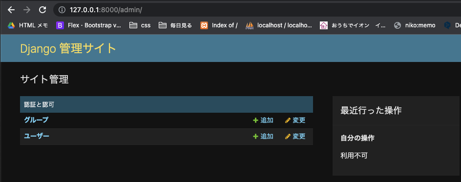
<br><br>

## base/admin.py-1

```python
from django.contrib import admin
from base.models import Item, Tag   # モデルを読み込む
from django.contrib.auth.models import Group  # 元からあるグループ

admin.site.register(Item)     # 管理者画面にモデルを反映させる
admin.site.register(Tag)
admin.site.unregister(Group)  # 元からある[グループ]を使わないので非表示に設定

# register　　...表示
# unregister ...非表示
```

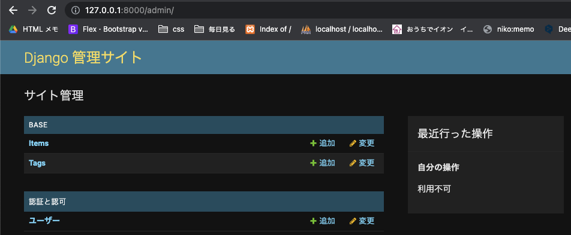
<br><br>
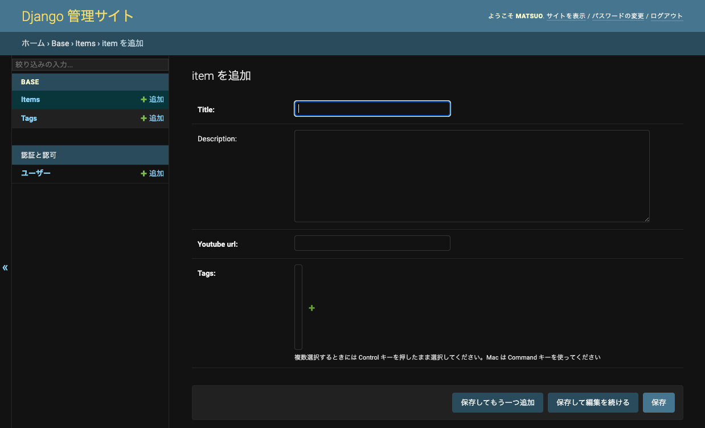

<br>

## base/admin.py-2
tagをインラインで追加できるようにする

```python
    from django.contrib import admin
    from base.models import Item, Tag   # モデルを読み込む
    from django.contrib.auth.models import Group  # 元からあるグループ


+   class TagInline(admin.TabularInline):
+       model = Item.tags.through

+   class ItemAdmin(admin.ModelAdmin):
+       inlines = [TagInline] # クラスTagInlineをinlinesに渡す
+       exclude = ['tags']    # モデル作成時に作った'tags'をexclude(除外)する

-   admin.site.register(Item)     # 管理者画面にモデルを反映させる
+   admin.site.register(Item, ItemAdmin)     # 管理者画面にモデルを反映させる
    admin.site.register(Tag)
    admin.site.unregister(Group)  # 元からある[グループ]を使わないので非表示に設定

# register　　...表示
# unregister ...非表示
```

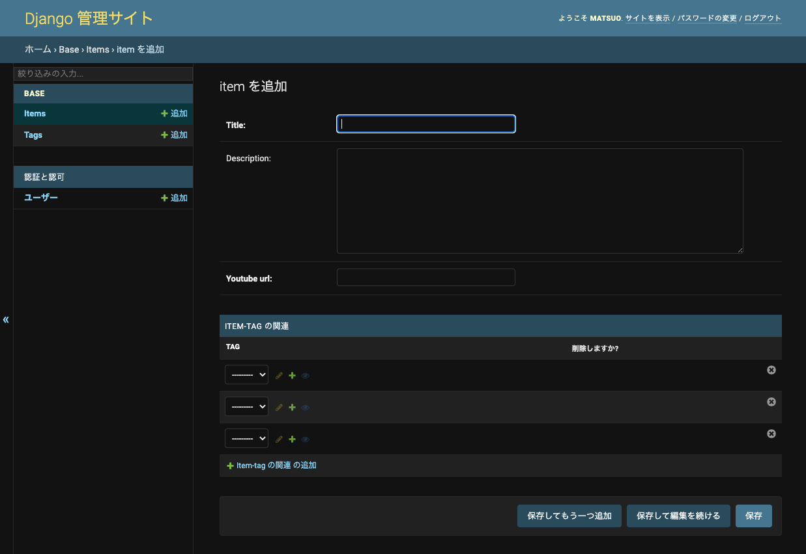
<br><br>
アイテムを3つくらい登録する<br>
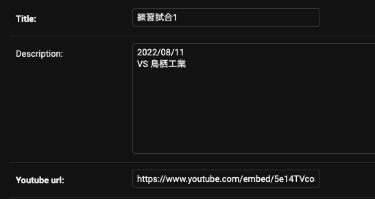

<br><br>

## index.htmlの修正
```html
    

    

    <h1>index.html</h1>
+   
+   <p>{{object.title}}</p>
+   <p>{{object.description}}</p>
+   <p>{{object.youtube_url}}</p>
+   

    
```

## base/views/item_views.py

```python
-   from django.shortcuts import render


-   def index(request):
-       return render(request, 'pages/index.html')


+   from django.views.generic import ListView
+   from base.models import Item


+   class IndexListView(ListView):
+       model = Item     # Itemモデルのデータを持ってくる
+       template_name = 'pages/index.html'
```

## config/urls.py

```python
    from django.contrib import admin
    from django.urls import path
    from base import views # 追加

    urlpatterns = [
        path('admin/', admin.site.urls),
        # Items
+       path('', views.IndexListView.as_view()),  # トップページ
-       path('', views.index, name='index'),
    ]
```

### 登録アイテムが3つとも一覧で表示されているのを確認<br>
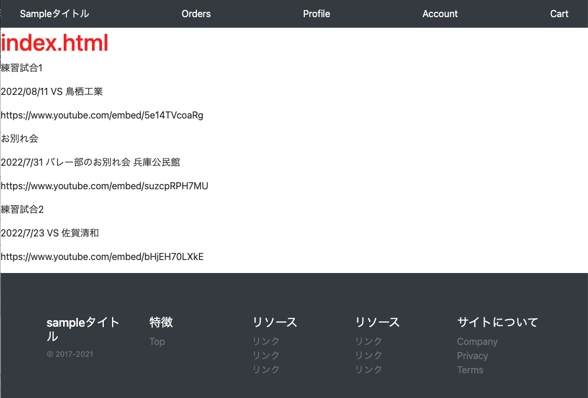

<br><br>

## トップページの修正
### templates
templates<br>
├── pages<br>
│   └── index.html<br>
├── snippets<br>
│   ├── footer.html<br>
│   ├── header.html<br>
│   └── item_box.html　　　追加<br>
└── base.html<br>

### templates/pages/index.html

```html
    

    

-   <h1>index.html</h1>

+   <div class="container" style="max-width:100%">
+   <div class="row my-5">
+       
+       <div class="col-12 col-lg-3 my-3">
+       
+       </div>
+       
+   </div>
+   </div>


-   
-   <p>{{object.title}}</p>
-   <p>{{object.description}}</p>
-   <p>{{object.youtube_url}}</p>
-   

    
```

### templates/snippets/item_box.html

```html
<div class="card w-100">
  <div class="card-body">
    <h5 class="card-title">{{object.title}}</h5>
    <p class="card-text">{{object.description}}</p>
    <iframe src="{{object.youtube_url}}" title="YouTube video player" frameborder="0" allow="accelerometer; autoplay; clipboard-write; encrypted-media; gyroscope; picture-in-picture" allowfullscreen></iframe>
  </div>
</div>
```

<br><br>

## サーバーを立ち上げ外面を確認
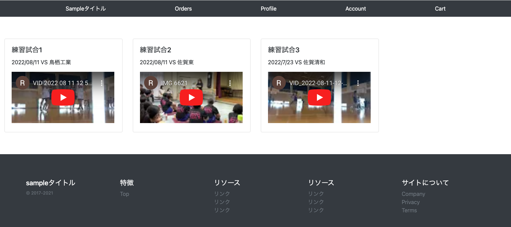
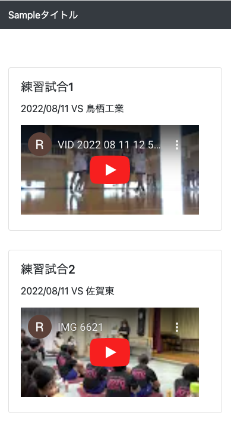

<br><br>

## git push, herokuのデータベースを反映させる


```python
(myvenv) basketball-tube % git add .
(myvenv) basketball-tube % git commit -m"item model"
(myvenv) basketball-tube % git push origin master
(myvenv) basketball-tube % git push heroku master
(myvenv) basketball-tube % heroku run python manage.py migrate
# ここでエラーが出た データベースの構成が不適切
django.core.exceptions.ImproperlyConfigured: settings.DATABASES is improperly configured. Please supply the ENGINE value. Check settings documentation for more details.
# PostgresqlのインスタンスがHeroku上に自動で作成されているか確認
(myvenv) basketball-tube % heroku addons -a ryukoku-basketball
No add-ons for app ryukoku-basketball.
# Posgresがなかったのでインスタンスを作成
(myvenv) basketball-tube % heroku addons:create heroku-postgresql:hobby-dev
```

エラーが出てからの対処方法<br>
[参考url:HerokuにDjangoをデプロイする際のPostgresの設定](https://qiita.com/norifumi92/items/4ba835234762289b24d0)

### config/settings.py
HerokuではディフォルトでDATABASE_URLにPostgresのパスが設定されている<br>
5行追加する

```python
    if not DEBUG:
        # Heroku settings

        # staticの設定
        import os
        import django_heroku

+       import dj_database_url
+       db_from_env = dj_database_url.config()
+       DATABASES = {
+           'default': dj_database_url.config()
+       }
    ...
```


```python
(myvenv) basketball-tube % git add .
(myvenv) basketball-tube % git commit -m"settings.py heroku_db add"
(myvenv) basketball-tube % git push origin master
(myvenv) basketball-tube % git push heroku master
(myvenv) basketball-tube % heroku run python manage.py migrate
(myvenv) basketball-tube % heroku run python manage.py createsuperuser
ユーザー名 (leave blank to use 'u52411'): matsuo
メールアドレス: matsuokuniko7@gmail.com
Password:
Password (again):
Superuser created successfully.
```

<br><br>

## https://ryukoku-basketball.herokuapp.com/ へアクセス
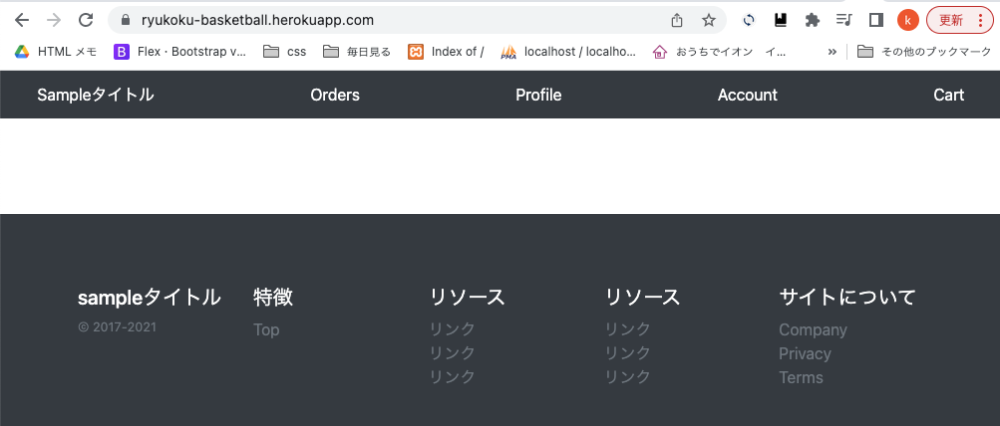

<br>

### admin画面に入りitemを追加する
https://ryukoku-basketball.herokuapp.com/admin
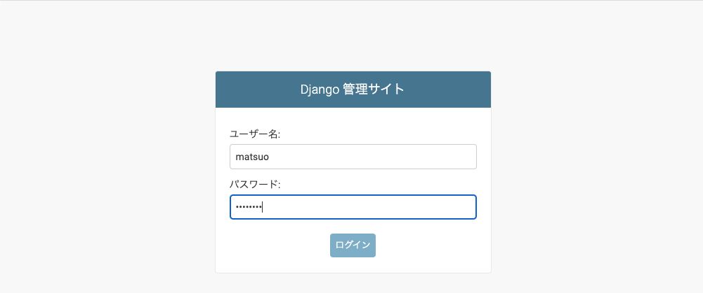

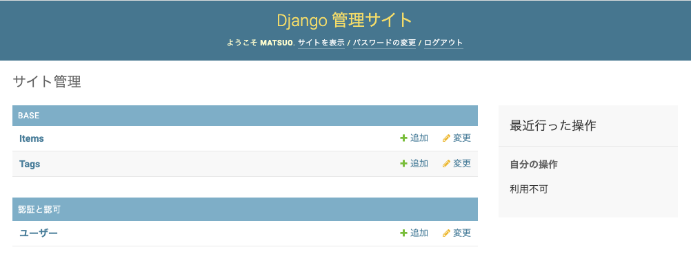


### index.htmlにItemの一覧が表示されているのを確認　OK!


## この後は、'08_タグの表示'をする、その後03をする