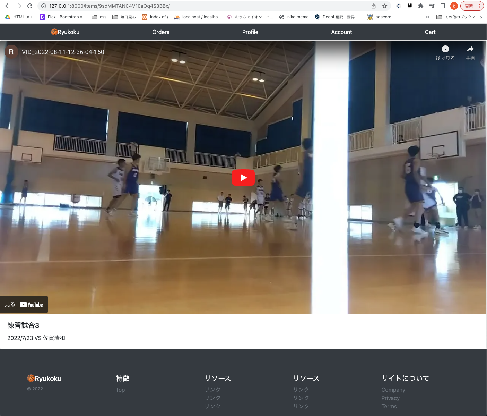
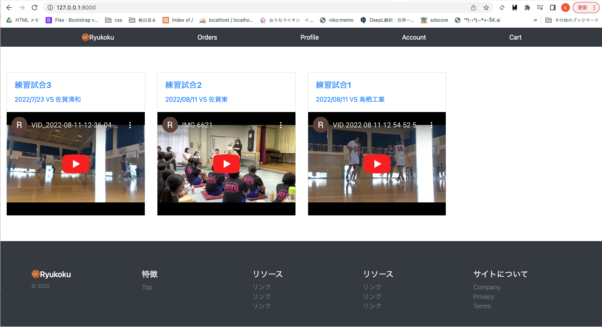

<!-- omit in toc -->
# 各動画ページ'item_detail.html'の作成、リンク
index.htmlの動画リストの中から動画カードをクリックすると、個別の動画item_detail.htmlが表示される<br>
Itemモデルの動画、タイトル、詳細などが表示される<br>
動画をクリックすると、そのページで再生する<br>


- [templates](#templates)
  - [templates/pages/index.html](#templatespagesindexhtml)
  - [templates/snippets/item_box.html　修正](#templatessnippetsitem_boxhtml修正)
  - [templates/pages/item_detail.html](#templatespagesitem_detailhtml)
- [base/views/item_views.py](#baseviewsitem_viewspy)
- [config/urls.py](#configurlspy)
- [(templatesの一部ちょっと修正)](#templatesの一部ちょっと修正)
  - [templates/base.html](#templatesbasehtml)
  - [templates/snippets/header.html](#templatessnippetsheaderhtml)
- [サーバーを立ち上げ確認](#サーバーを立ち上げ確認)

## templates
templates<br>
├── pages<br>
│   ├── index.html<br>
│   └── item_detail.html　　　　追加<br>
├── snippets<br>
│   ├── footer.html<br>
│   ├── header.html<br>
│   └── item_box.html<br>
└── base.html<br>

### templates/pages/index.html
動画アイテムを新しいものから取得　`reversed`

```html
-   
+   
    <div class="col-12 col-lg-3 my-3">
      
    </div>
    
```

### templates/snippets/item_box.html　修正
カードデザインの変更<br>
iframeをレスポンシブ対応<br>
1行目の`<a>タグ`で個別の動画ページitem_detail.htmlへのリンク<br>

```html
<a href="/items/{{object.pk}}/" style="text-decoration:none;">
  <div class="card w-100">
    <div class="card-body">
      <h5 class="card-title">{{object.title}}</h5>
      <p class="card-text">{{object.description}}</p>
    </div>
    <div class="embed-responsive embed-responsive-4by3">
      <iframe class="embed-responsive-item" src="{{object.youtube_url}}" title="YouTube video player" frameborder="0">
      </iframe>
    </div>
  </div>
</a>
```

### templates/pages/item_detail.html
src="{{object.youtube_url}}?rel=0"　動画の後に`?rel=0`をつけると関連動画が出なくなる<br>
[参考ur: YouTube の動画埋め込みで表示される関連動画や次の動画を非表示にする方法](https://hirashimatakumi.com/blog/5849.html#:~:text=%E5%8B%95%E7%94%BB%E5%9F%8B%E3%82%81%E8%BE%BC%E3%81%BF%E6%99%82%E3%81%AE%E9%96%A2%E9%80%A3,0%20%E3%82%92%E8%BF%BD%E5%8A%A0%E3%81%97%E3%81%BE%E3%81%99%E3%80%82)

```html




<div class="card w-100">
  <div class="embed-responsive embed-responsive-16by9">
    <iframe class="embed-responsive-item" src="{{object.youtube_url}}?rel=0" title="YouTube video player" frameborder="0" allow="accelerometer; autoplay; clipboard-write; encrypted-media; gyroscope; picture-in-picture" allowfullscreen></iframe>
  </div>
  <div class="card-body">
    <h5 class="card-title">{{object.title}}</h5>
    <p class="card-text">{{object.description}}</p>
  </div>
</div>


```

<br><br>

## base/views/item_views.py
```python
    # from django.shortcuts import render
-   from django.views.generic import ListView
+   from django.views.generic import ListView, DetailView
    from base.models import Item


    class IndexListView(ListView):
        model = Item     # Itemモデルのデータを持ってくる
        template_name = 'pages/index.html'


    # Itemモデルのpkをもとに個別データを返す
+   class ItemDetailView(DetailView):
+       model = Item
+       template_name = 'pages/item_detail.html'
```

<br><br>

## config/urls.py
```python
    from django.contrib import admin
    from django.urls import path
    from base import views

    urlpatterns = [
        path('admin/', admin.site.urls),
        path('', views.IndexListView.as_view()),  # トップページ
+       path('items/<str:pk>/', views.ItemDetailView.as_view()),  # 個別のItem詳細ページ
    ]
```

<br><br>

## (templatesの一部ちょっと修正)
### templates/base.html
```html
    <head>
-     <title>Sampleタイトル</title>
+     <title>🏀Ryukoku</title>
    </head>
```

### templates/snippets/header.html
```html
-   <a class="py-2 text-white" href="/">Sampleタイトル</a>
+   <a class="py-2 text-white" href="/">🏀Ryukoku</a>
```

<br><br>

## サーバーを立ち上げ確認


<br><br>

一覧から動画カードをクリックすると、個別の動画item_detail.htmlが表示される　OK!<br>
動画をクリックすると、そのページで再生する


