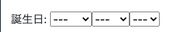
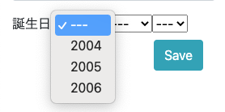
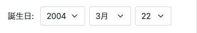
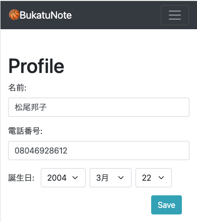

# 誕生日の入力はセレクトがやりやすい
04_カスタムユーザーモデル.mdの続き<br>
日付はカレンダーから入力する方法を取りがちだけど、誕生日は生まれた年までさかのぼり必要なので、selectが一番いいと思う<br>
Widgetを使うため、Formの作成、viewへ渡す。


- [参考url: プロフィールの日付(誕生日)入力の3パターン作成方法を公開](https://freeheroblog.com/profile-form/)

- [誕生日の入力はセレクトがやりやすい](#誕生日の入力はセレクトがやりやすい)
- [views](#views)
  - [base/views/account_views.py](#baseviewsaccount_viewspy)
- [html](#html)
  - [templates/pages/profile.html](#templatespagesprofilehtml)
- [forms](#forms)
  - [base/forms/account_forms.py](#baseformsaccount_formspy)
    - [説明1: `SelectDateWidget`を使う `forms.SelectDateWidget()`<br>](#説明1-selectdatewidgetを使う-formsselectdatewidget)
    - [説明2: yearsパラメータのリストを今の高校生が生まれた年だけにする](#説明2-yearsパラメータのリストを今の高校生が生まれた年だけにする)
    - [説明3: Bootstrapで form-select を横並び](#説明3-bootstrapで-form-select-を横並び)
    - [完成形:](#完成形)
- [css](#css)
  - [static/css/style.css](#staticcssstylecss)
- [確認](#確認)

<br><br>

# views
## base/views/account_views.py

ProfileCreateFormを持ってくるので、fieldsは不要
```python
    from django.views.generic import CreateView, UpdateView
    from django.contrib.auth.views import LoginView
    from django.contrib.auth.mixins import LoginRequiredMixin # ログインしている人だけ
    from django.contrib.auth import get_user_model
+   from base.models import Profile
-   from base.forms import UserCreationForm
+   from base.forms import UserCreationForm, ProfileCreateForm

    class SignUpView(CreateView):
        ...


    class Login(LoginView):
        ...


    class AccountUpdateView(LoginRequiredMixin, UpdateView):
        ...


    class ProfileUpdateView(LoginRequiredMixin, UpdateView):
        model = Profile
        template_name = 'pages/profile.html'
+       form_class = ProfileCreateForm
-       fields = ('name', 'tel', 'birth_day')
        success_url = '/profile/'

        def get_object(self):
            # URL変数ではなく、現在のユーザーから直接pkを取得
            self.kwargs['pk'] = self.request.user.pk
            return super().get_object()
```

# html
## templates/pages/profile.html
```html




<div class="container my-5">
  <div class="row">
    <div class="col-12">
      <h1>Profile</h1>
      <form method="POST">
        
        {{form}}
        <div class="text-right col-md-4">
          <button type="submit" class="btn btn-info btm-sm">Save</button>
        </div>
      </form>
    </div>
  </div>
</div>


```

# forms
## base/forms/account_forms.py
### 説明1: `SelectDateWidget`を使う `forms.SelectDateWidget()`<br>
```python
birth_date = forms.DateField(
    label="誕生日: ",
    widget=forms.SelectDateWidget(),
)
```



### 説明2: yearsパラメータのリストを今の高校生が生まれた年だけにする
- [参考url: Django fun(Django SelectDateWidget)](https://django.fun/en/qa/193625/)
```python
this_year = date.today().year
year_range = [x for x in range(this_year - 18, this_year -15)] # [2004, 2005, 2006]
birth_date = forms.DateField(
    label="誕生日: ",
    widget=forms.SelectDateWidget(years=year_range),
)
```


### 説明3: Bootstrapで form-select を横並び
Bootstrapでform-selectだと縦並びになるので、cssで調整する
```python
this_year = date.today().year
year_range = [x for x in range(this_year - 18, this_year -15)] # [2004, 2005, 2006]
birth_date = forms.DateField(
    label="誕生日: ",
    widget=forms.SelectDateWidget(years=year_range,
        attrs={'class': 'form-select inline_block_select ml-2',}),
)
```

### 完成形:
```python
    from django import forms
    from django.contrib.auth import get_user_model
+   from base.models import Profile
+   from django.contrib.admin.widgets import AdminDateWidget
+   from datetime import date


    class UserCreationForm(forms.ModelForm):
        ...

+   class ProfileCreateForm(forms.ModelForm):
+       """動画投稿フォーム"""
+       class Meta:
+           model = Profile

+           # select中身作成
+           this_year = date.today().year
+           year_range = [x for x in range(this_year - 18, this_year -15)]

+           fields  = ('name', 'tel', 'birth_day', ) # 表示順番
+           labels = {'name': '名前', 'tel': '電話番号', 'birth_day': '誕生日',}
+           widgets = {
+               'name': forms.TextInput(
+                   attrs={'class': 'form-control mb-3  col-md-4', 'placeholder': '',}),
+               'tel': forms.TextInput(
+                   attrs={'class': 'form-control mb-3 col-md-4',}),
+               'birth_day': forms.SelectDateWidget(years=year_range,
+                   attrs={'class': 'form-select inline_block_select ml-2',}),
+           }
```

<br>

# css
## static/css/style.css
```css
.inline_block_select {
  width: auto;
  display: inline-block;
}
```
<br>

# 確認

