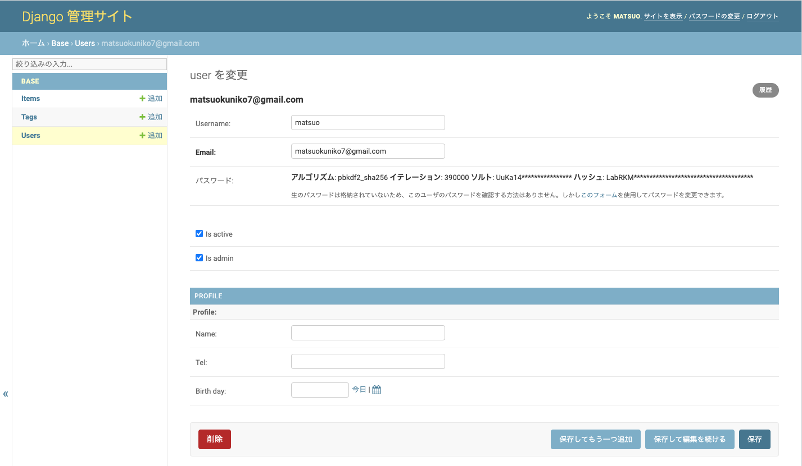
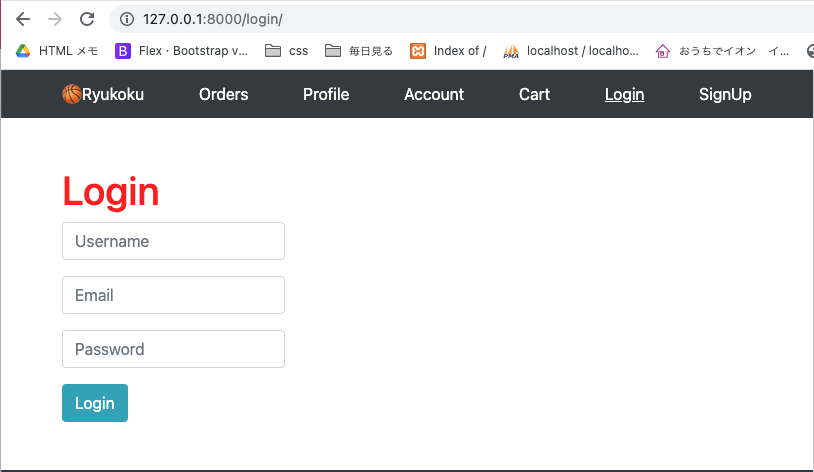
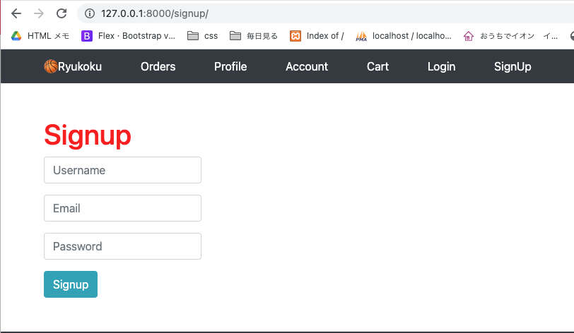
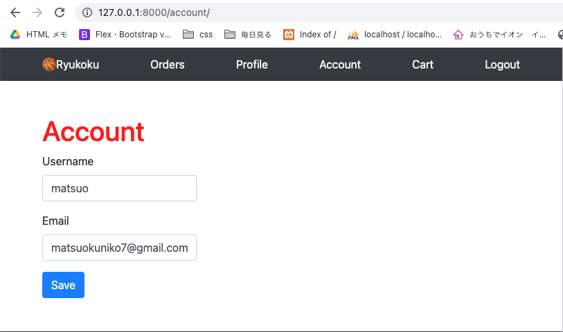
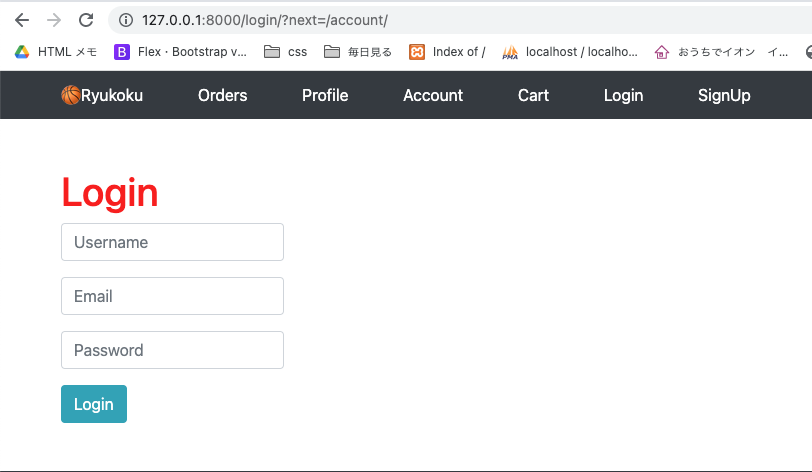
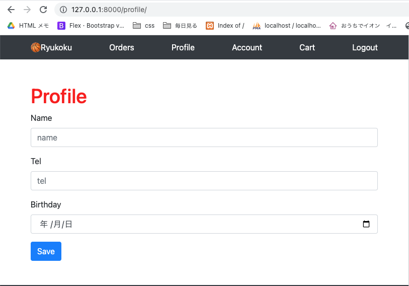

<!-- omit in toc -->
# カスタムユーザーモデル

カスタムユーザーモデルの定義・作成<br>
これまでDjangoのデフォルトのユーザーモデルを使用してきましたが、ここで独自のカスタムユーザーモデルへ作り替えます<br>
ユーザーモデルは認証に関わるコアな部分のみとし、そのほかのユーザーのプロフィール情報（生年月日）について別で`Profile`モデルを実装し、そちらをOneToOneで関連させます。<br>
実装が完了した段階で、データベース等を作り直し、改めてユーザーやアイテムを登録していきます。<br>
[参考url: OneToOneFieldを利用してUserモデルを拡張する](https://daeudaeu.com/django-user-onetoonefield/)
[参考url: Djangoカスタムユーザーモデルのドキュメント](https://docs.djangoproject.com/ja/3.2/topics/auth/customizing/#a-full-example)<br>

- [カスタムユーザーモデル作成](#カスタムユーザーモデル作成)
  - [base/models/__init__.py](#basemodelsinitpy)
  - [base/models/account_models.py　作成](#basemodelsaccount_modelspy作成)
  - [カスタムユーザーモデル説明](#カスタムユーザーモデル説明)
    - [receiver, post_save, sender](#receiver-post_save-sender)
    - [BaseUserManager, AbstractBaseUser](#baseusermanager-abstractbaseuser)
- [config/setting.py](#configsettingpy)
  - [ログアウト機能について](#ログアウト機能について)
- [base/forms.pyを作成](#baseformspyを作成)
- [base/admin.py カスタムユーザーの設定](#baseadminpy-カスタムユーザーの設定)
- [DB削除とマイグレーション履歴削除](#db削除とマイグレーション履歴削除)
- [postgresデータベースデータベースを作成](#postgresデータベースデータベースを作成)
- [マイグレーションし、新しくスーパーユーザーを作り直す](#マイグレーションし新しくスーパーユーザーを作り直す)
- [サーバーを立ち上げ、管理者画面にログイン、アイテム追加](#サーバーを立ち上げ管理者画面にログインアイテム追加)
- [ログイン機能](#ログイン機能)
  - [config/urls.py](#configurlspy)
  - [templates/snippets/header.html](#templatessnippetsheaderhtml)
  - [view](#view)
    - [base/views/__init__.py    account_views.pyの追加](#baseviewsinitpy----account_viewspyの追加)
    - [base/views/account_views.py](#baseviewsaccount_viewspy)
      - [ログイン必須機能(ログインしている人だけが開けるページ)の追加 LoginRequiredMixin, login_required](#ログイン必須機能ログインしている人だけが開けるページの追加-loginrequiredmixin-login_required)
  - [templates](#templates)
    - [templates/pages/login_signup.html](#templatespageslogin_signuphtml)
    - [templates/pages/account.html](#templatespagesaccounthtml)
    - [templates/pages/profile.html 新しく作成](#templatespagesprofilehtml-新しく作成)
- [git push](#git-push)
- [04_1誕生日の入力はセレクトがやりやすい.mdへ続く](#04_1誕生日の入力はセレクトがやりやすいmdへ続く)


## カスタムユーザーモデル作成

base<br>
├── models<br>
│   ├── __init__.py<br>
│   ├── account_models.py　　追加<br>
│   └── item_models.py<br>
<br><br>

### base/models/__init__.py

```python
    from .item_models import *
+   from .account_models import *
```

### base/models/account_models.py　作成

```python
from django.dispatch import receiver
from django.db.models.signals import post_save
from django.db import models
from django.contrib.auth.models import BaseUserManager, AbstractBaseUser
from base.models import create_id # item_models.py のcreate_id関数(22文字のランダムな文字列を作る)
from datetime import date # 年齢計算用
from dateutil.relativedelta import relativedelta # 年齢計算用

# Djangoのユーザーモデルをカスタマイズ

class UserManager(BaseUserManager):
    # usernameとemailでログインする
    def create_user(self, username, email, password=None):
        if not email:
            raise ValueError('Users must have an email address')
        user = self.model(
            username=username,
            email=self.normalize_email(email),
        )
        user.set_password(password)
        user.save(using=self._db)
        return user

    def create_superuser(self, username, email, password=None):
        user = self.create_user(
            username,
            email,
            password=password,
        )
        user.is_admin = True
        user.save(using=self._db)
        return user

# ユーザーのコア情報
class User(AbstractBaseUser):
    id = models.CharField(default=create_id, primary_key=True, max_length=22)
    username = models.CharField(
        max_length=50, unique=True, blank=True, default='匿名')
    email = models.EmailField(max_length=255, unique=True)
    is_active = models.BooleanField(default=True)
    is_admin = models.BooleanField(default=False)
    objects = UserManager()
    USERNAME_FIELD = 'username'
    EMAIL_FIELD = 'email'
    REQUIRED_FIELDS = ['email', ]

    def __str__(self):
        return self.email

    def has_perm(self, perm, obj=None):
        "Does the user have a specific permission?"
        # Simplest possible answer: Yes, always
        return True

    def has_module_perms(self, app_label):
        "Does the user have permissions to view the app `app_label`?"
        # Simplest possible answer: Yes, always
        return True

    @property
    def is_staff(self):
        "Is the user a member of staff?"
        # Simplest possible answer: All admins are staff
        return self.is_admin


#ユーザーのプロフィール ユーザーコア情報と紐づいている
# blank=True 任意で入力でOK (注文時には空白NGとする)
class Profile(models.Model):
    # OneToOneField 1対1で紐づく.
    # on_delete=models.CASCADE ユーザーコア情報が削除されたらプロフィールも削除するよ
    user = models.OneToOneField(
        User, primary_key=True, on_delete=models.CASCADE)
    name = models.CharField(default='', blank=True, max_length=50) # 名前(宛名)
    tel = models.CharField(default='', blank=True, max_length=15) # tel
    birth_day = models.DateField(blank=True, null=True) # 生年月日
    created_at = models.DateTimeField(auto_now_add=True) # 作成日
    updated_at = models.DateTimeField(auto_now=True) # 更新日

    def __str__(self):
        return self.name

# ユーザーコア情報作成時にプロフィールも同時に作れる
# OneToOneFieldを同時に作成
@receiver(post_save, sender=User) # Userモデルが入力保存されたときに実行する
def create_onetoone(sender, **kwargs):
    if kwargs['created']:
        Profile.objects.create(user=kwargs['instance'])
```

### カスタムユーザーモデル説明
[参考url:Django AbstractBaseUserでカスタムユーザー作成](https://noumenon-th.net/programming/2019/12/13/abstractbaseuser/)

  1. receiver, post_save, sender
  2. BaseUserManager, AbstractBaseUser

#### receiver, post_save, sender
`@receiver(post_save, sender=User)`<br>
post_save：Userモデルがsaveメソッドの実行を完了したのを受けて動く

```python
from django.dispatch import receiver
from django.db.models.signals import post_save


# ユーザーのコア情報
class User(AbstractBaseUser):
    ...

#ユーザーのプロフィール ユーザーコア情報と紐づいている
class Profile(models.Model):
    ...

# ユーザーコア情報作成時にプロフィールも同時に作れる
# OneToOneFieldを同時に作成
@receiver(post_save, sender=User) # Userモデルが入力保存されたときに実行する
def create_onetoone(sender, **kwargs):
    if kwargs['created']:
        Profile.objects.create(user=kwargs['instance'])
```

#### BaseUserManager, AbstractBaseUser
[参考url:Django Userモデルをカスタマイズする方法](https://itc.tokyo/django/user/)


## config/setting.py

```python

# カスタムユーザーモデルを使うための設定
AUTH_USER_MODEL = 'base.User' # base.Userモデルを使う

LOGIN_URL = '/login/' # 未ログイン時に遷移するURL

LOGIN_REDIRECT_URL = '/' # ログインした後に遷移するURL

LOGOUT_URL = '/logout/'

LOGOUT_REDIRECT_URL = '/login/' # ログアウトした後に遷移するURL

一番下に追記する
```

### ログアウト機能について
Djangoの`LogoutView機能を使うとログアウトのviewを省略`できる<br>
config/urls.pyとheader.htmlはそれぞれのページに記載している<br>

```python
# config/setting.py
LOGOUT_URL = '/logout/'
LOGOUT_REDIRECT_URL = '/login/'


# config/urls.py
from django.contrib.auth.views import LogoutView
urlpatterns = [
    path('logout/', LogoutView.as_view()),
]

# templates/snippets/header.html
<nav>
<a href="/logout/">Logout</a>
</nav>
```

## base/forms.pyを作成

base<br>
├── __pycache__<br>
├── migrations<br>
├── models<br>
├── views<br>
├── __init__.py<br>
├── admin.py<br>
├── apps.py<br>
├── forms.py　　追加<br>
└── tests.py<br>


base/forms.py

```python
from django import forms
from django.contrib.auth import get_user_model


class UserCreationForm(forms.ModelForm):
    password = forms.CharField()

    class Meta:
        model = get_user_model()
        fields = ('username', 'email', 'password', )

    def clean_password(self):
        # cleaned_dataにはformの中で 検証された後適切なデータとして確認されたデータが入ります。
        password = self.cleaned_data.get("password")
        return password

    def save(self, commit=True):
        user = super().save(commit=False)
        user.set_password(self.cleaned_data["password"])
        if commit:
            user.save()
        return user
```

##  base/admin.py カスタムユーザーの設定

```python

    from django.contrib import admin
    from django.contrib.auth.models import Group
-   from base.models import Item, Tag
+   from base.models import Item, Tag, User, Profile
+   from base.forms import UserCreationForm
+   from django.contrib.auth.admin import UserAdmin

    class TagInline(admin.TabularInline):
        model = Item.tags.through

    class ItemAdmin(admin.ModelAdmin):
        inlines = [TagInline]
        exclude = ['tags']

+   # カスタムユーザー用
+   class ProfileInline(admin.StackedInline):
+       model = Profile
+       can_delete = False

+   class CustomUserAdmin(UserAdmin):
+       # 管理画面に表示するもの. 2段に分けて表示
+       fieldsets = (
+           (None, {'fields': ('username', 'email', 'password',)}),
+           (None, {'fields': ('is_active', 'is_admin',)}),
+       )

+       list_display = ('username', 'email', 'is_active',)
+       list_filter = ()
+       ordering = () # 一覧表示の並び替えのキーの設定ができる 今回未使用
+       filter_horizontal = ()

+       # 管理画面でユーザーを作成するときに使う項目の設定
+       add_fieldsets = (
+           (None, {'fields': ('username', 'email', 'is_active',)}),
+       )

+       # 管理画面でも自作のフォームが使える
+       add_form = UserCreationForm
+       # 管理画面のユーザーページに同じユーザーのプロフィールを入れる
+       inlines = (ProfileInline,)

    admin.site.register(Item, ItemAdmin)
    admin.site.register(Tag)
+   admin.site.register(User, CustomUserAdmin) # カスタムユーザーで追加
    admin.site.unregister(Group)  # 元からあるグループを使わないので非表示に
```

## DB削除とマイグレーション履歴削除
1. base/migrations の中の 0001_initial.pyを削除
2. base/migrations/pycache の中の 0001_initial.cpython-39.pycを削除(pythonのキャッシュファイル)
3. データベースを削除する(sqlite3の時はファイルを削除する)
  postgresデータベースを削除するやり方

  ```python
  # psql postgresに入る
  (myvenv) niko@kunikonoMacBook-Pro basketball-tube % psql postgres
  # dbをドロップする
  postgres=# drop database db_basketball_tube;
  DROP DATABASE
  ```

## postgresデータベースデータベースを作成

```python
(myvenv) niko@kunikonoMacBook-Pro basketball-tube % psql postgres
# データベースを作る
postgres=# CREATE DATABASE db_basketball_tube;
CREATE DATABASE
# ユーザー登録などは01_環境設定でしているのでしなくて良い
# ユーザーとデータベースをくっつける
postgres=# GRANT ALL PRIVILEGES ON DATABASE db_basketball_tube TO user_basketball_tube;
GRANT
postgres=#
\q
# データベースができているか確認する
(myvenv) niko@kunikonoMacBook-Pro basketball-tube % psql -U user_basketball_tube -d db_basketball_tube
db_basketball_tube=>
\q
```

## マイグレーションし、新しくスーパーユーザーを作り直す

```python
(myvenv) niko@kunikonoMacBook-Pro basketball-tube % python manage.py makemigrations
Migrations for 'base':
  base/migrations/0001_initial.py
    - Create model User
    - Create model Tag
    - Create model Profile
    - Create model Item
(myvenv) niko@kunikonoMacBook-Pro basketball-tube % python manage.py migrate
...
(myvenv) niko@kunikonoMacBook-Pro basketball-tube % python manage.py createsuperuser
Username: matsuo
Email: matsuokuniko7@gmail.com
Password:
Password (again):
Superuser created successfully.
```

base<br>
├── migrations<br>
│   ├── __pycache__<br>
│   ├── __init__.py<br>
│   └── 0001_initial.py　　自動で作られている<br>


## サーバーを立ち上げ、管理者画面にログイン、アイテム追加
- ユーザーモデルの下にプロフィールモデルも表示されているのを確認

<br><br>

- アイテムモデル作成時に作ったアイテム3つは削除したので、新しく3つ入力する(写真省略)

## ログイン機能
### config/urls.py

```python
    from django.contrib import admin
    from django.urls import path
    from base import views
+   from django.contrib.auth.views import LogoutView # 追加 viewは自作せずdjangoの機能を使う

    urlpatterns = [
        path('admin/', admin.site.urls),

        path('', views.IndexListView.as_view()),  # トップページ
        path('items/<str:pk>/', views.ItemDetailView.as_view()),  # 個別のItem詳細ページ

+       # Account 追加
+       path('login/', views.Login.as_view()),
+       path('logout/', LogoutView.as_view()),
+       path('signup/', views.SignUpView.as_view()),
+       path('account/', views.AccountUpdateView.as_view()),
+       path('profile/', views.ProfileUpdateView.as_view()),
+   ]
```

### templates/snippets/header.html

```html
    <div class="py-1 bg-dark ">
      <nav class="container d-flex flex-column flex-md-row justify-content-between">
        <a class="py-2 text-white" href="/">🏀Ryukoku</a>
        <a class="py-2 d-none d-md-inline-block text-white" href="/orders/">Orders</a>
        <a class="py-2 d-none d-md-inline-block text-white" href="/profile/">Profile</a>
        <a class="py-2 d-none d-md-inline-block text-white" href="/account/">Account</a>
        <a class="py-2 d-none d-md-inline-block text-white" href="/cart/">Cart</a>
+       <!-- ログインしているか、していないかで出しわけ -->
+       
+       <a class="py-2 d-none d-md-inline-block text-white" href="/logout/">Logout</a>
+       
+       <a class="py-2 d-none d-md-inline-block text-white" href="/login/">Login</a>
+       <a class="py-2 d-none d-md-inline-block text-white" href="/signup/">SignUp</a>
        
      </nav>
    </div>
```

ログイン状態<br>

ログアウト状態<br>


### view

base/views<br>
├── __pycache__<br>
├── __init__.py<br>
├── account_views.py　　追加<br>
└── item_views.py<br>

#### base/views/__init__.py    account_views.pyの追加

```python
    from .item_views import *
+   from .account_views import *
```

#### base/views/account_views.py

```python
from django.views.generic import CreateView, UpdateView
from django.contrib.auth.views import LoginView
from django.contrib.auth.mixins import LoginRequiredMixin # ログインしている人だけ
from django.contrib.auth import get_user_model
from base.models import Profile
from base.forms import UserCreationForm

class SignUpView(CreateView):
    form_class = UserCreationForm
    success_url = '/login/'
    template_name = 'pages/login_signup.html'

    def form_valid(self, form):
        return super().form_valid(form)

class Login(LoginView):
    template_name = 'pages/login_signup.html'

    def form_valid(self, form):
        return super().form_valid(form)

    def form_invalid(self, form):
        return super().form_invalid(form)

# ログインしている人だけが開けるページ
# login_requiredはdefのときに使うので
# 今回は、クラス用のLoginRequiredMixinを使う
class AccountUpdateView(LoginRequiredMixin, UpdateView):
    model = get_user_model()
    template_name = 'pages/account.html'
    fields = ('username', 'email',)
    success_url = '/account/' # 更新後も同じページを返す

    def get_object(self):
        # URL変数ではなく、現在のユーザーから直接pkを取得
        self.kwargs['pk'] = self.request.user.pk
        return super().get_object()

class ProfileUpdateView(LoginRequiredMixin, UpdateView):
    model = Profile
    template_name = 'pages/profile.html'
    fields = ('name', 'tel')
    success_url = '/profile/'

    def get_object(self):
        # URL変数ではなく、現在のユーザーから直接pkを取得
        self.kwargs['pk'] = self.request.user.pk
        return super().get_object()
```

##### ログイン必須機能(ログインしている人だけが開けるページ)の追加 LoginRequiredMixin, login_required
[参考url](https://itc.tokyo/django/loginrequiredmixin/)
ログインしている人だけが開けるページを作る時に使う
LoginRequiredMixin：　自動的にログイン画面へリダイレクトしてくれます。ログイン後には元いたページへ戻る設定
クラス用とdef用があり、書き方がちがう<br>

```python
# viewに書く
# クラス用

from django.contrib.auth.mixins import LoginRequiredMixin # ログインしている人だけ(クラス用)

class AccountUpdateView(LoginRequiredMixin, UpdateView):


# def用

from django.contrib.auth.decorators import login_required # ログインしている人だけ(def用)

@login_required   # デコレーダーで使う
def remove_from_cart(request, pk): # pk:Itempk
```


### templates
#### templates/pages/login_signup.html
ログインとサインアップを一枚のファイルにしている<br>
ログインとサインアップを出し分ける<br>

```html
<!-- ログインとサインアップを一枚のファイルにしている -->
<!-- ログインとサインアップを出し分ける -->



<div class="container my-5">
  <div class="row ">
    <div class="col-12">
      <h1>
        <!-- ログインとサインアップを出し分ける -->
        <!-- request.pathの中にloginがあれば... -->
        
        Login
        
        Signup
        
      </h1>
      <form method="POST">
        
        <div class="form-row">
          <div class="form-group col-md-4">
            <input type="text" class="form-control" name="username" placeholder="Username">
          </div>
        </div>
        <div class="form-row">
          <div class="form-group col-md-4">
            <input type="email" class="form-control" name="email" placeholder="Email" required>
          </div>
        </div>
        <div class="form-row">
          <div class="form-group col-md-4">
            <input type="password" class="form-control" name="password" placeholder="Password" required>
          </div>
        </div>
        <button class="btn btn-info btm-sm" type="submit">
          <!-- ログインとサインアップを出し分ける -->
          
          Login
          
          Signup
          
        </button>
      </form>
    </div>
  </div>
</div>


```
<table>
<tr>
<td width="49%">

`request.pathの中にlogin`がある時<br>
http://127.0.0.1:8000/login/
</td>
<td width="49%">

`request.pathの中にsignup`がある時<br>
http://127.0.0.1:8000/signup/
</td>
</tr>
<tr>
<td width="49%">

</td>
<td width="49%">

</td>
</tr>
</table>

#### templates/pages/account.html

ユーザー情報をユーザーが画面上で変更できるようにするためのページ

```html
<!-- ユーザー情報をユーザーが画面上で変更できるようにするためのページ -->




<div class="container my-5">
  <div class="row">
    <div class="col-12">
      <h1>Account</h1>
      <form method="POST">
        
        <div class="form-row">
          <div class="form-group col-md-4">
            <label>Username</label>
            <input class="form-control" type="text" name="username" placeholder="name" value="{{user.username}}">
          </div>
        </div>
        <div class="form-row">
          <div class="form-group col-md-4">
            <label>Email</label>
            <input class="form-control" type="email" name="email" placeholder="Email" value="{{user.email}}" required>
          </div>
        </div>
        <button type="submit" class="btn btn-primary">Save</button>
      </form>
    </div>
  </div>
</div>


```

`LoginRequiredMixin`でログインしている人だけが入れるようになっている
<table>
<tr>
<td width="49%">

ログインしている時<br>
http://127.0.0.1:8000/account/<br>
　
</td>
<td width="49%">

ログインしていない時<br>
http://127.0.0.1:8000/login/?next=/account/<br>
ログインしたら、http://127.0.0.1:8000/account/へ遷移するよ
</td>
</tr>
<tr>
<td width="49%">

</td>
<td width="49%">

</td>
</tr>
</table>


#### templates/pages/profile.html 新しく作成

プロフィール情報をユーザーが画面上で変更できるようにするためのページ

```html
<!-- プロフィール情報をユーザーが画面上で変更できるようにするためのページ -->





<div class="container my-5">
  <div class="row">
    <div class="col-12">
      <h1>Profile</h1>
      <form method="POST">
        
        <div class="form-group ">
          <label>Name</label>
          <input class="form-control" type="text" name="name" placeholder="name" value="{{user.profile.name}}">
        </div>
        <div class="form-group">
          <label>Tel</label>
          <input class="form-control" type="tel" name="tel" placeholder="tel" value="{{user.profile.tel}}">
        </div>
        <div class="form-group">
          <label>Birthday</label>
          <input class="form-control" type="date" name="birthday" placeholder="birthday" value="{{user.profile.birth_day}}">
        </div>
        <button type="submit" class="btn btn-primary">Save</button>
      </form>
    </div>
  </div>
</div>


```

account.html同様に`LoginRequiredMixin`でログインしている人だけが入れるようになっている
<table>
<tr>
<td width="49%">

ログインしている時<br>
http://127.0.0.1:8000/profile/<br>
</td>
<td width="49%">

ログインしていない時<br>
account.html同様にログイン画面に推移し、ログイン後、profile.htmlをかえす<br>
</td>
</tr>
<tr>
<td width="49%">

</td>
<td width="49%">
</td>
</tr>
</table>


## git push
`git commit -m"custom_user, login-logout add"`<br>
<br><br>
今後のherokuへのpushは機能が揃ってから行っていく。
<br><br><br><br>


## 04_1誕生日の入力はセレクトがやりやすい.mdへ続く