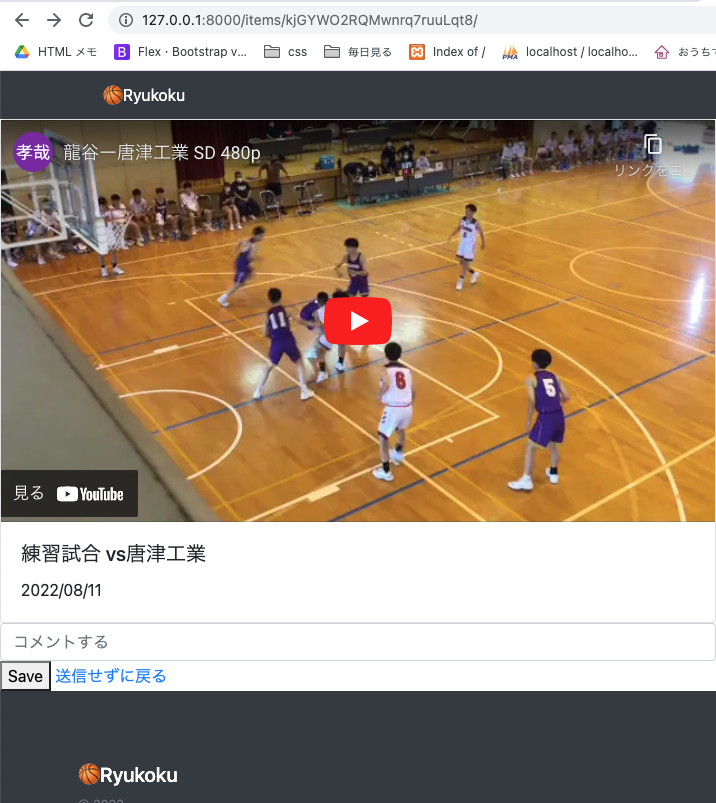
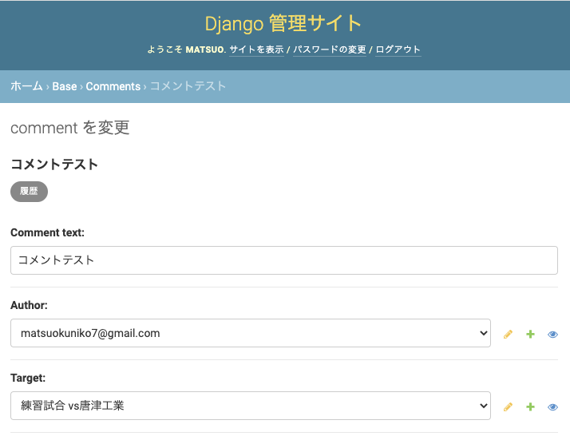
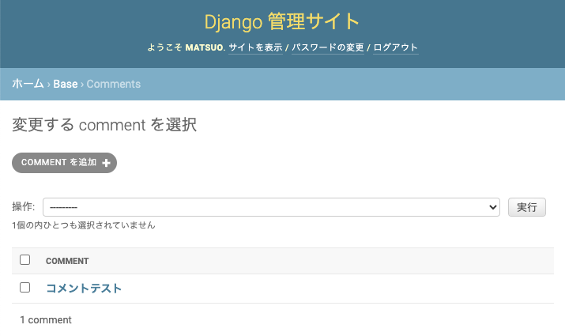

<!-- omit in toc -->
# 動画にコメントを書く:DetailViewとFormを一つのページに出す
選択した動画ページからコメント書くを実装する<br>
選択した動画ページに、コメントの投稿フォームを作ってCommentモデルに保存する

完成<br>



<br><br>

- [models](#models)
  - [base/models/__ init __.py](#basemodels__-init-__py)
  - [base/models/item_comment_models.py 追加](#basemodelsitem_comment_modelspy-追加)
  - [Commentモデルのマイグレーション](#commentモデルのマイグレーション)
- [base/admin.py](#baseadminpy)
- [forms](#forms)
  - [base/forms/__ init __.py](#baseforms__-init-__py)
  - [base/forms/item_comment_forms.py　追加](#baseformsitem_comment_formspy追加)
- [templates](#templates)
  - [templates/pages/item_detail.html](#templatespagesitem_detailhtml)
- [views](#views)
  - [base/views/item_views.py](#baseviewsitem_viewspy)
    - [class ItemDetailView(ModelFormMixin, DetailView)を作るにあたり参考にしたサイト](#class-itemdetailviewmodelformmixin-detailviewを作るにあたり参考にしたサイト)
    - [解説　Djangoの動き](#解説djangoの動き)
- [サーバー起動し確認](#サーバー起動し確認)

<br><br>

## models
base<br>
├── __ pycache __<br>
├── __ init __.py<br>
├── account_models.py<br>
├── item_comment_models.py　　追加<br>
└── item_models.py<br>

### base/models/__ init __.py
```python
    from .item_models import *
    # modelsを呼び出せば、item_models.pyも呼び出せる
    from .account_models import *
+   from .item_comment_models import *
```

### base/models/item_comment_models.py 追加
```python
from django.db import models
from .account_models import User
from .item_models import Item


class Comment(models.Model):
    """動画に紐づくコメント"""

    comment_text = models.CharField(default='', max_length=1000) # コメント
    author = models.ForeignKey(User, on_delete=models.CASCADE) # 投稿者Userモデルpk
    target = models.ForeignKey(Item, on_delete=models.CASCADE) # 対象動画Itemモデルpk
    created_at = models.DateTimeField(auto_now_add=True) # 作成日 自動作成
    updated_at = models.DateTimeField(auto_now=True) ## 更新日 自動作成

    def __str__(self):
        return self.comment_text[:20]
```

### Commentモデルのマイグレーション
```python
(myvenv) niko@kunikonoMacBook-Pro basketball-tube % python manage.py makemigrations
(myvenv) niko@kunikonoMacBook-Pro basketball-tube % python manage.py migrate
```

<br><br>

## base/admin.py
管理画面にCommentモデルの追加
```python
    from xml.etree.ElementTree import Comment
    from django.contrib import admin
    from django.contrib.auth.models import Group  # 元からあるグループ
-   from base.models import Item, Tag, User, Profile
+   from base.models import Item, Tag, User, Profile, Comment
    from base.forms import UserCreationForm
    from django.contrib.auth.admin import UserAdmin

    class TagInline(admin.TabularInline):
        model = Item.tags.through

    class ItemAdmin(admin.ModelAdmin):
        inlines = [TagInline] # クラスTagInlineをinlinesに渡す
        exclude = ['tags']    # モデル作成時に作った'tags'をexclude(除外)する

    # カスタムユーザー用
    class ProfileInline(admin.StackedInline):
        model = Profile
        can_delete = False
    class CustomUserAdmin(UserAdmin):
        # 管理画面に表示するもの. 2段に分けて表示
        fieldsets = (
            (None, {'fields': ('username', 'email', 'password',)}),
            (None, {'fields': ('is_active', 'is_admin',)}),
        )

        list_display = ('username', 'email', 'is_active',)
        list_filter = ()
        ordering = () # 一覧表示の並び替えのキーの設定ができる 今回未使用
        filter_horizontal = ()

        # 管理画面でユーザーを作成するときに使う項目の設定
        add_fieldsets = (
            (None, {'fields': ('username', 'email', 'is_active',)}),
        )

        # 管理画面でも自作のフォームが使える
        add_form = UserCreationForm
        # 管理画面のユーザーページに同じユーザーのプロフィールを入れる
        inlines = (ProfileInline,)


    admin.site.register(Item, ItemAdmin)     # 管理者画面にモデルを反映させる
    admin.site.register(Tag)
+   admin.site.register(Comment)
    admin.site.register(User, CustomUserAdmin) # カスタムユーザーで追加
    admin.site.unregister(Group)  # 元からある[グループ]を使わないので非表示に設定

    # register　　...表示
    # unregister ...非表示
```

<br><br>

## forms
base<br>
├── __ pycache __<br>
├── __ init __.py<br>
├── account_forms.py<br>
└── item_comment_forms.py　　追加<br>

### base/forms/__ init __.py
```python
    from .item_forms import *
    # formsを呼び出せば、item_forms.pyも呼び出せる
    from .account_forms import *
+   from .item_comment_forms import *
```


### base/forms/item_comment_forms.py　追加
```python
from django import forms
from base.models import Comment


class CommentCreateForm(forms.ModelForm):
    """コメント投稿フォーム"""
    class Meta:
        model = Comment
        widgets = {
            'comment_text': forms.TextInput(
                attrs={
                    'placeholder': 'コメントする',
                    'class': 'form-control',
        })}
        # exclude:フォーム画面では表示されない
        exclude = ('author','target', 'created_at', 'updated_at')
```

- [参考url: forms.pyでwidgetsを使う](https://freeheroblog.com/form-add-class/)
- [参考url: ModelFormの使い方をわかりやすく解説](https://kosuke-space.com/django-modelform)

<br><br>

## templates
### templates/pages/item_detail.html
コメント投稿フォームの追加
```html
    

    

    <div class="card w-100">
      <div class="embed-responsive embed-responsive-16by9">
        <iframe class="embed-responsive-item" src="{{object.youtube_url}}?rel=0" title="YouTube video player" frameborder="0" allow="accelerometer; autoplay; clipboard-write; encrypted-media; gyroscope; picture-in-picture" allowfullscreen></iframe>
      </div>
      <div class="card-body">
        <h5 class="card-title">{{object.title}}</h5>
        <p class="card-text">{{object.description}}</p>
      </div>
    </div>

+   <!-- コメント作成用 -->
+   <form method="POST">
+     
+     {{ form.comment_text }}
+     <button type="submit">Save</button>
+     <a class="button btn-link" href="">送信せずに戻る</a>
+   </form>

    
```

<br><br>

## views
### base/views/item_views.py
```python
    from django.views.generic import ListView, DetailView
    from base.models import Item
+   from django.views.generic.edit import ModelFormMixin
+   from base.forms import CommentCreateForm
+   from django.urls import reverse
+   from django.shortcuts import get_object_or_404
+   from django.http import HttpResponseRedirect


    class IndexListView(ListView):
        model = Item     # Itemモデルのデータを持ってくる
        template_name = 'pages/index.html'


    # Itemモデルのpkをもとに個別データを返す
    # class ItemDetailView(DetailView):
    #     model = Item
    #     template_name = 'pages/item.html'


+   class ItemDetailView(ModelFormMixin, DetailView):
+       """
+       個別の動画ページ(item_detail.html)
+       動画(Itemモデル)DetailViewとコメント投稿フォーム
+       投稿->保存->リダイレクト
+       """
+       model = Item
+       template_name = 'pages/item_detail.html'
+       context_object_name = 'items'
+       form_class = CommentCreateForm

+       # no get_context_data override

+       def post(self, request, *args, **kwargs):
+           # first construct the form to avoid using it as instance
+           form = self.get_form() # Formを取得
+           self.object = self.get_object() # Itemのこと

+           def form_valid(self, form):
+               item = get_object_or_404(Item, pk=self.object.pk)
+               comment = form.save(commit=False)
+               comment.target = item
+               comment.author = self.request.user
+               comment.save()
+               return HttpResponseRedirect(self.get_success_url())

+           if form.is_valid():
+               return form_valid(self, form)
+           else:
+               return self.form_invalid(form)

+       def get_success_url(self):
+           return reverse('item_detail', kwargs={'pk': self.object.pk})
```


#### class ItemDetailView(ModelFormMixin, DetailView)を作るにあたり参考にしたサイト
- [参考url:詳細ビューとフォーム Mixin django の混合に関する問題](https://stackoverflow.com/questions/66503703/problem-with-mixing-detail-view-and-form-mixin-django)
- [参考url:DjangoGithub](https://github.com/django/django/blob/3.0/django/views/generic/edit.py#L70)
- [参考url:[Django] FormViewについて詳しく見てみる](https://e-tec-memo.herokuapp.com/article/285/)
- [参考url:Djangoのクラスベースビューを完全に理解する](https://www.membersedge.co.jp/blog/completely-guide-for-django-class-based-views/)


#### 解説　Djangoの動き
このコードの動きをDjangoのGithubで確認していく
```python
if form.is_valid():
    return form_valid(self, form) # selfはつかないMy仕様で作成
else:
    return self.form_invalid(form)
```

`if form.is_valid():`<br>
取得したFormのis_validを呼んで入力が正しいか検証して、<br>
正しければform_validメソッドを、<br>
何か不備があればform_invalidメソッドを呼ぶ<br>

`return form_valid(self, form)`
- 仕様の`return self.form_valid(form)`の場合の __Djangoの動き__
    ```python
    # class FormMixinの時
    def form_valid(self, form):
        """フォームが有効な場合、指定されたURLにリダイレクトします"""
        return HttpResponseRedirect(self.get_success_url())

    # class ModelFormMixin(FormMixin, SingleObjectMixin):の時
    def form_valid(self, form):
        """フォームが有効な場合、関連するモデルを保存する"""
        self.object = form.save()
        return super().form_valid(form)
    ```

    - つまり、フォームが有効な場合、<br>
        指定されたURLにリダイレクトする<br>
        関連するモデルを保存する

<br>

- 自作の `return form_valid(self, form)`を使う理由<br>
    Commentモデルのauthorとtargetを一緒にsaveしたかったから

`return self.form_invalid(form)`
  ```python
  def form_invalid(self, form):
      """フォームが無効な場合、無効なフォームをレンダリングする"""
      return self.render_to_response(self.get_context_data(form=form))
  ```

<br><br>

## サーバー起動し確認

投稿フォーム　OK!


<br><br>
コメントが保存されている


<br><br>
UserとItemから紐づいて保存されているのを確認　OK!

