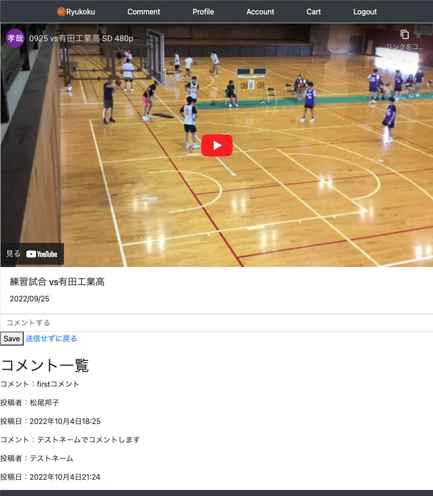

<!-- omit in toc -->
# 06_item_detail.htmlにCommetのlistも表示
前回動画詳細ページにコメントフォームを作ったので、
コメントの一覧も表示する
__今回viewの変更の必要はない__

- [templates](#templates)
  - [templates/pages/item_detail.html](#templatespagesitem_detailhtml)
  - [インスタンス名.モデル名で互いにアクセス](#インスタンス名モデル名で互いにアクセス)
- [サーバー起動し確認](#サーバー起動し確認)

<br><br>

## templates
### templates/pages/item_detail.html
```html
    

    

    <div class="card w-100">
      <div class="embed-responsive embed-responsive-16by9">
        <iframe class="embed-responsive-item" src="{{object.youtube_url}}?rel=0" title="YouTube video player" frameborder="0" allow="accelerometer; autoplay; clipboard-write; encrypted-media; gyroscope; picture-in-picture" allowfullscreen></iframe>
      </div>
      <div class="card-body">
        <h5 class="card-title">{{object.title}}</h5>
        <p class="card-text">{{object.description}}</p>
      </div>
    </div>

    <!-- コメント作成用 -->
    <form method="POST">
      
      {{ form.comment_text }}
      <button type="submit">Save</button>
      <a class="button btn-link" href="">送信せずに戻る</a>
    </form>

    <br>

+   <div>
+     <h2>コメント一覧</h2>
+     
+     <div>
+       <p>コメント：{{ comment.comment_text }}</p>
+       <p>投稿者：{{ comment.author.profile.name }}</p>
+       <p>投稿日：{{ comment.updated_at }}</p>
+     </div>
+     
+   </div>

    
```

### インスタンス名.モデル名で互いにアクセス
userインスタンスからはuser.profile、profileインスタンスからはprofile.userでアクセスできる<br>
```python
>>> from snippets.models import Profile
>>> from django.contrib.auth.models import User

>>> user = User.objects.get(pk=1)
>>> user.profile.bio
>>> "Hi there! I'm kazuo."

>>> profile = Profile.objects.get(user=user)
>>> profile.user.username
>>> 'kazuo'
```

`User モデル`には元々 `profile` というデータ属性は存在しませんが、<br>
`Profile モデル` 側に OneToOneField(User, 略) のフィールドを持たせておくことで、<br>
__User にモデル名（Profile）を小文字にした profile データ属性が自動的に追加される__ ことになります。<br>
```python
# comment.author = self.request.user
comment.author                 # matsuokuniko7@gmail.com
comment.author.profile.name    # 松尾邦子
```

- [参考url: Djangoのテーブル間リレーションシップを理解する](https://brhk.me/programing/django-foreignkey/)
- [参考url: OneToOneFieldを利用してUserモデルを拡張する](https://daeudaeu.com/django-user-onetoonefield/)


<br>

## サーバー起動し確認
detailに紐づくコメントだけが表示されている
