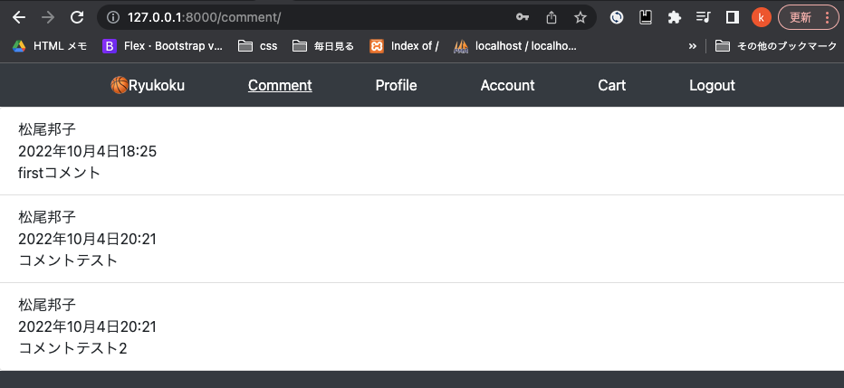
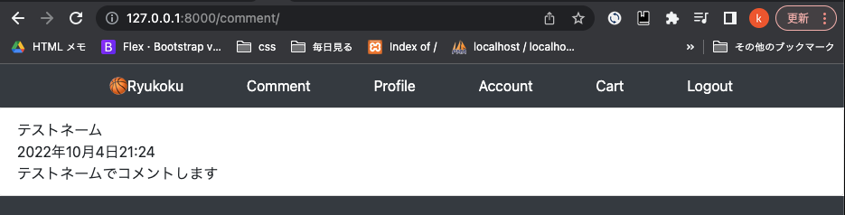

<!-- omit in toc -->
# 自分が投稿したコメントだけのページ.

- [views](#views)
  - [base/views/item_views.py](#baseviewsitem_viewspy)
- [config/urls.py](#configurlspy)
- [templates](#templates)
  - [templates/snippets/header.html](#templatessnippetsheaderhtml)
  - [templates/pages/comment.html](#templatespagescommenthtml)
- [サーバー起動して確認](#サーバー起動して確認)
- [git](#git)

<br><br>

## views
### base/views/item_views.py
```python
    from django.views.generic import ListView, DetailView
-   from base.models import Item
+   from base.models import Item, Comment
    from django.views.generic.edit import ModelFormMixin
    from base.forms import CommentCreateForm
    from django.urls import reverse
    from django.shortcuts import get_object_or_404
    from django.http import HttpResponseRedirect


# 一番下に追加
+   class CommentListView(ListView):
+       model = Comment     # Itemモデルのデータを持ってくる
+       template_name = 'pages/comment.html'
```

## config/urls.py
```python
    from django.contrib import admin
    from django.urls import path
    from base import views
    from django.contrib.auth.views import LogoutView # 追加 viewは自作せずdjangoの機能を使う

    urlpatterns = [
        path('admin/', admin.site.urls),

        path('', views.IndexListView.as_view()),  # トップページ
+       path('comment/', views.CommentListView.as_view()),  # 自分のコメントページ
        path('items/<str:pk>/', views.ItemDetailView.as_view(), name="item_detail"),

        # Account 追加
        path('login/', views.Login.as_view()),
        path('logout/', LogoutView.as_view()),
        path('signup/', views.SignUpView.as_view()),
        path('account/', views.AccountUpdateView.as_view()),
        path('profile/', views.ProfileUpdateView.as_view()),
    ]
```

## templates
### templates/snippets/header.html
```html
    <nav class="container d-flex flex-column flex-md-row justify-content-between">
      <a class="py-2 text-white" href="/">🏀Ryukoku</a>
+     <a class="py-2 d-none d-md-inline-block text-white" href="/comment/">Comment</a>
    </nav>
```

### templates/pages/comment.html
```html





<ol class="list-group list-group-numbered">
  
  
  <li class="list-group-item d-flex justify-content-between align-items-start">
    <div class="ms-2 me-auto">
      <div class="fw-bold">{{object.author.profile.name}}</div>
      <div class="fw-bold">{{object.updated_at}}</div>
      {{object.comment_text}}
    </div>
  </li>
  
  
</ol>


```

## サーバー起動して確認
2人のユーザーでログインして確認. それぞれのコメントだけが表示されている　OK!



<br>

## git
comment.html add Show only comments of logged-in users<br>

ヘッダーを編集したり、youtubeの動きを変更したりしたので、cssのgit push をした<br>

css fix /item_box.html,item_detail.html,header.html,base.html<br>

