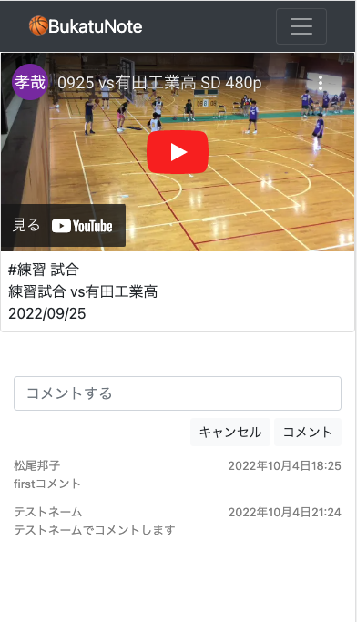
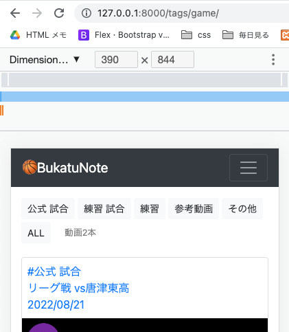

<!-- omit in toc -->
# タグの表示とページネーション(02＿モデルの後にやったほうがよかったかな)
1. タグを表示させる
2. Tagを選択したら、そのタグの動画アイテムだけを表示する
3. ページネーションの実装
4. タグごとの動画の本数を表示する

- [タグを表示させる](#タグを表示させる)
  - [タグをadmin管理画面で登録する](#タグをadmin管理画面で登録する)
  - [Itemモデルにタグを追加登録する](#itemモデルにタグを追加登録する)
  - [Views](#views)
    - [base/views/item_views.py](#baseviewsitem_viewspy)
  - [templates](#templates)
    - [templates/pages/index.html](#templatespagesindexhtml)
    - [templates/snippets/item_box.html](#templatessnippetsitem_boxhtml)
    - [解説：TagモデルとItemモデルのtagの取得のちがい](#解説tagモデルとitemモデルのtagの取得のちがい)
  - [サーバー起動して確認](#サーバー起動して確認)
    - [cssの修正](#cssの修正)
      - [templates/pages/index.html](#templatespagesindexhtml-1)
      - [templates/snippets/item_box.html](#templatessnippetsitem_boxhtml-1)
      - [static/css/style.css](#staticcssstylecss)
  - [templates](#templates-1)
    - [templates/pages/item_detail.html](#templatespagesitem_detailhtml)
- [Tagを選択したら、そのタグの動画アイテムだけを表示する](#tagを選択したらそのタグの動画アイテムだけを表示する)
  - [views](#views-1)
    - [base/views/item_views.py](#baseviewsitem_viewspy-1)
  - [config/urls.py](#configurlspy)
  - [templates](#templates-2)
    - [/Users/niko/Desktop/MyApp/Django/basketball-tube/templates/pages/index.html](#usersnikodesktopmyappdjangobasketball-tubetemplatespagesindexhtml)
  - [画面確認](#画面確認)
- [ページネーションの実装](#ページネーションの実装)
  - [views](#views-2)
  - [templates](#templates-3)
    - [templates/pages/index.html](#templatespagesindexhtml-2)
    - [templates/snippets/pagination.html 追加](#templatessnippetspaginationhtml-追加)
  - [画面の確認](#画面の確認)
- [タグごとの動画の本数を表示する](#タグごとの動画の本数を表示する)
  - [views](#views-3)
    - [base/views/item_views.py](#baseviewsitem_viewspy-2)
  - [templates](#templates-4)
    - [templates/pages/index.html](#templatespagesindexhtml-3)
    - [画面確認](#画面確認-1)

<br><br>

# タグを表示させる
## タグをadmin管理画面で登録する
- タグ作成一覧<br>
| slug      |     | name      |
| :-------- | --- | :-------- |
| game      |     | 公式 試合 |
| practice  |     | 練習 試合 |
| training  |     | 練習      |
| reference |     | 参考動画  |
| others    |     | その他    |


## Itemモデルにタグを追加登録する


<br>

## Views
### base/views/item_views.py
[DjangoのListviewで複数モデルのデータを取り出す方法](https://qiita.com/yongjugithub/items/edd69e1ac6d4507f9ad1)

`context['tag_list'] = Tag.objects.all`でItemモデルとTagモデルは紐づいているので、Tagモデルの全てを取得できる
```python
-   from base.models import Item, Comment
+   from base.models import Item, Comment, Tag


    class IndexListView(ListView):
        model = Item     # Itemモデルのデータを持ってくる
        template_name = 'pages/index.html'
+       context_object_name = 'item_list'

+       def get_context_data(self, *args, **kwargs):
+           context = super().get_context_data(*args, **kwargs)
+           context['tag_list'] = Tag.objects.all # Tagモデルを全て取り出す
+           return context
```

## templates
### templates/pages/index.html
IndexListViewで、<br>
Itemモデルは`item_list`(context_object_name = 'item_list')で呼び出すと決めたので、呼び出しのtemplate変数を object_list -> item_list へ変更<br>
Itemモデルと紐づくTagモデルは、`tag_list`(context['tag_list'] = Tag.objects.all)で呼び出す<br>
```html
    

    

+   <div class="text">
+     <ul>
+       <!-- Tagモデルの全てを取得 -->
+       
+       <li>{{ tag.name }}</li>
+       
+     </ul>
+   </div>

    <div class="container" style="max-width:100%">
      <div class="row my-5">
-       
+       
        <div class="col-12 col-lg-3 my-3">
          
        </div>
        
      </div>
    </div>

    
```


### templates/snippets/item_box.html
Itemモデルの呼び出しtemplate変数を object_list -> item_list へ変更に変わったので、item_box.htmlも同様に変更<br>
`item`()で取得する
```html
-   <a href="/items/{{object.pk}}/" style="text-decoration:none;">
+   <a href="/items/{{item.pk}}/" style="text-decoration:none;">
      <div class="card w-100">
        <div class="card-body">
          <!-- 各Itemに紐づくtagを全て取得する -->
+         
+         <p class="card-text">#{{tag}}</p>
+         

-         <p class="card-text">{{object.title}}</p>
-         <p class="card-text">{{object.description}}</p>
+         <p class="card-text">{{item.title}}</p>
+         <p class="card-text">{{item.description}}</p>
        </div>
        <div class="embed-responsive embed-responsive-4by3">
          <iframe class="embed-responsive-item" src="https://www.youtube.com/embed/{{item.youtube_url}}?rel=0&modestbranding=1" title="YouTube video player" frameborder="0">
          </iframe>
        </div>
      </div>
    </a>
```

### 解説：TagモデルとItemモデルのtagの取得のちがい
```html
<!-- Tagモデルの全てを取得 -->

<li>{{ tag.name }}</li>


<!-- 各Itemに紐づくtagを全て取得する -->

<p class="card-text">#{{tag}}</p>

```

## サーバー起動して確認


Tagモデルのリストが表示されている OK!<br>
Itemモデルのtagsが表示されている OK!

### cssの修正
#### templates/pages/index.html
```html




<div class="container-fluid mt-5">
  <!-- Tagモデルの全てを取得 -->
  
  <a href="/tags/{{tag.slug}}/" class="btn btn-light btn-sm">{{ tag.name }}</a>
  
  <a href="/" class="btn btn-light btn-sm">ALL</a>
</div>

<div class="container" style="max-width:100%">
  <div class="row mt-2 mb-5">
    
    <div class="col-12 col-lg-3 my-1">
      
    </div>
    
  </div>
</div>


```

#### templates/snippets/item_box.html
```html
<a href="/items/{{item.pk}}/">
  <div class="card w-100">
    <div class="card-body">
      <!-- 各Itemに紐づくtagを全て取得する -->
      
      <p class="card-text">#{{tag}}</p>
      

      <p class="card-title">{{item.title}}</p>
      <p class="card-text">{{item.description}}</p>
    </div>
    <div class="embed-responsive embed-responsive-4by3">
      <iframe class="embed-responsive-item" src="https://www.youtube.com/embed/{{item.youtube_url}}?rel=0&modestbranding=1" title="YouTube video player" frameborder="0">
      </iframe>
    </div>
  </div>
</a>
```

#### static/css/style.css
```css
/* 訪問後のリンクの色を変えない */
a,a:visited{
    color: #212529;/*カラーコードは任意*/
}

/* リンクテキストの下線を消す */
a {
text-decoration: none;
}

/* ****************************************************** */
/* bootstrapのclass */
.card-body {
  padding: 0.5rem;

}
.card-title, .card-text {
  margin: 0;
}

small {
  color: gray;
}
```

<br>


<br><br>

## templates
### templates/pages/item_detail.html
Itemモデルの呼び出しとTagを上と同じように修正する
```html




<div class="card w-100">
  <div class="embed-responsive embed-responsive-16by9">
    <!-- embed: 埋め込み, rel=0: 関連動画を非表示, modestbranding=1: YouTubeロゴの非表示 -->
    <iframe class="embed-responsive-item" src="https://www.youtube.com/embed/{{object.youtube_url}}?rel=0&modestbranding=1" title="YouTube video player" frameborder="0" allow="accelerometer; autoplay; clipboard-write; encrypted-media; gyroscope; picture-in-picture" allowfullscreen>
    </iframe>
  </div>
  <div class="card-body">
    <!-- 各Itemに紐づくtagを全て取得する -->
    
    <p class="card-text">#{{tag}}</p>
    
    <p class="card-title">{{items.title}}</p>
    <p class="card-text">{{items.description}}</p>
  </div>
</div>

<!-- コメント作成用 -->
<div class="container my-5">
  <form method="POST">
    
    {{ form.comment_text }}
    <div class="text-right my-2">
      <button type="submit" class="btn btn-light btn-sm">キャンセル</button>
      <button type="" class="btn btn-light btn-sm">コメント</button>
    </div>
  </form>

  <!-- コメント一覧用 -->
  <div class="container">
    
    <div class="mb-2">
      <div class="row justify-content-between">
        <div><small>{{comment.author.profile.name}}</small></div>
        <div><small>{{comment.updated_at}}</small></div>
      </div>
      <div class="row">
        <small>{{comment.comment_text}}</small>
      </div>
    </div>
    
  </div>
</div>


```

<br>


<br><br><br>

# Tagを選択したら、そのタグの動画アイテムだけを表示する
## views
### base/views/item_views.py

`IndexListViewクラスを継承`しているのでコードが少ない<br>
`TagListView`と`IndexListView`は同じ pages/index.htmlを返します.<br>
def get_queryset(self)で、選択したtabのItemをかえす

```python
+   class TagListView(IndexListView, ListView):
+       paginate_by = 2 # テスト用
+
+       def get_queryset(self): # get_queryset の上書き
+           self.tag = Tag.objects.get(slug=self.kwargs['pk'])
+           return Item.objects.filter(tags=self.tag)
```

<br><br>

## config/urls.py
```python
    from django.contrib import admin
    from django.urls import path
    from base import views
    from django.contrib.auth.views import LogoutView # 追加 viewは自作せずdjangoの機能を使う

    urlpatterns = [
        path('admin/', admin.site.urls),

        path('', views.IndexListView.as_view()),  # トップページ
+       path('tags/<str:pk>/', views.TagListView.as_view()), # 選択タグの動画表示
        path('comment/', views.CommentListView.as_view()),  # 自分のコメントページ
        path('items/<str:pk>/', views.ItemDetailView.as_view(), name="item_detail"),

        # Account 追加
        path('login/', views.Login.as_view()),
        path('logout/', LogoutView.as_view()),
        path('signup/', views.SignUpView.as_view()),
        path('account/', views.AccountUpdateView.as_view()),
        path('profile/', views.ProfileUpdateView.as_view()),
    ]
```

<br><br>

## templates
### /Users/niko/Desktop/MyApp/Django/basketball-tube/templates/pages/index.html
`TagListView`と`IndexListView`は同じ pages/index.htmlを返します

```html




<div class="container-fluid mt-5">
  <!-- Tagモデルの全てを取得 -->
  
  <a href="/tags/{{tag.slug}}/" class="btn btn-light btn-sm">{{ tag.name }}</a>
  
  <a href="/" class="btn btn-light btn-sm">ALL</a>
</div>

<div class="container" style="max-width:100%">
  <div class="row mt-2 mb-5">
    
    <div class="col-12 col-lg-3 my-1">
      
    </div>
    
  </div>
</div>


```

## 画面確認
トップ画面


<br>
練習試合(practice)タグを選択した場合<br>
練習試合だけのItemが取得できている<br>

<br>

練習試合は3つ登録していたが、1ページに2つしか表示しないテスト設定にしている(`paginate_by = 2`)<br>

<br>

# ページネーションの実装
django.views.generic.list.ListView は、表示されたリストをページ分割する組み込みの方法を提供します。<br>
例えば、ビュークラスに paginate_by 属性を追加することで、これを行うことができます。
## views
すでにIndexListViewクラスで`paginate_by = 2`で記述すみなので新しく記述は不要
```python
class IndexListView(ListView):
    model = Item     # Itemモデルのデータを持ってくる
    template_name = 'pages/index.html'
    context_object_name = 'item_list'
    paginate_by = 2 # テスト用
```

<br>

## templates
### templates/pages/index.html
```html
    

    

    <div class="container-fluid mt-5">
      <!-- Tagモデルの全てを取得 -->
      
      <a href="/tags/{{tag.slug}}/" class="btn btn-light btn-sm">{{ tag.name }}</a>
      
      <a href="/" class="btn btn-light btn-sm">ALL</a>
    </div>

    <div class="container" style="max-width:100%">
      <div class="row mt-2 mb-5">
        
        <div class="col-12 col-lg-3 my-1">
          
        </div>
        
      </div>
    </div>

+   <!-- ページング処理の部分 -->
+   <div class="container my-3">
+     
+   </div>

    
```

### templates/snippets/pagination.html 追加
```html
<!-- ページング処理の部分 -->
<nav>
  <ul class="pagination justify-content-center">
    <!-- 「前へ」の部分 -->
    
    <li class="page-item">
      <a class="page-link" href="?page={{ page_obj.previous_page_number }}" aria-label="Previous">
        <span aria-hidden="true">&laquo;</span>
        <span class="sr-only">Previous</span>
      </a>
    </li>
    

    <!-- 数字部分 -->
    
    
    <li class="page-item active">
      <a class="page-link" href="#">{{ num }}<span class="sr-only">(current)</span></a>
    </li>
    
    <li class="page-item">
      <a class="page-link" href="?page={{ num }}">{{ num }}</a>
    </li>
    
    

    <!-- 「次へ」 の部分 -->
    
    <li class="page-item">
      <a class="page-link" href="?page={{ page_obj.next_page_number }}" aria-label="Next">
        <span aria-hidden="true">&raquo;</span>
        <span class="sr-only">Next</span>
      </a>
    </li>
    
  </ul>
</nav>
```


- [Djangoのページネーションのドキュメント](https://docs.djangoproject.com/en/4.1/topics/pagination/)
- [ページング処理をgeneric.ListViewを使わずに実装する（paginate_by）](https://rurukblog.com/post/Django-paginate-non-generic/)
- [参考url: bootstrapのページネーションのドキュメント](https://getbootstrap.jp/docs/4.2/components/pagination/)

<br>

## 画面の確認
トップ画面　5つの動画アイテムのうち、ページ設定の2つの動画アイテムが表示されている<br>

<br><br><br>
ページネーションで動きの確認　OK!


<br><br>

# タグごとの動画の本数を表示する
## views
### base/views/item_views.py
```python
    class IndexListView(ListView):
        model = Item     # Itemモデルのデータを持ってくる
        template_name = 'pages/index.html'
        context_object_name = 'item_list'
        paginate_by = 8
        # paginate_by = 2 # テスト用

        def get_context_data(self, *args, **kwargs):
            context = super().get_context_data(*args, **kwargs)
            context['tag_list'] = Tag.objects.all
+           context['total_item'] = Item.objects.all().count()
            return context


    class TagListView(IndexListView, ListView):
        paginate_by = 8
        # paginate_by = 2 # テスト用

        def get_queryset(self): # get_queryset の上書き
            self.tag = Tag.objects.get(slug=self.kwargs['pk'])
            return Item.objects.filter(tags=self.tag)

+       def get_context_data(self, *args, **kwargs):
+           context = super().get_context_data(*args, **kwargs)
+           context['total_item'] = Item.objects.filter(tags=self.tag).count()
+           return context
```

## templates
### templates/pages/index.html
```html
    

    

    <div class="container-fluid my-3">
      <!-- Tagモデルの全てを取得 -->
      
      <a href="/tags/{{tag.slug}}/" class="btn btn-light btn-sm mb-1">{{ tag.name }}</a>
      
      <a href="/" class="btn btn-light btn-sm">ALL</a>
+     <small class="ml-3">動画 {{total_item}}本</small>
    </div>

    <div class="container" style="max-width:100%">
      <div class="row mt-2 mb-5">
        
        <div class="col-12 col-lg-3 my-1">
          
        </div>
        
      </div>
    </div>

    <!-- ページング処理の部分 -->
    <div class="container">
      
    </div>

    
```

### 画面確認
全部の時と、タグを選んだ時. それぞれの本数が表示できている<br>

<br>
