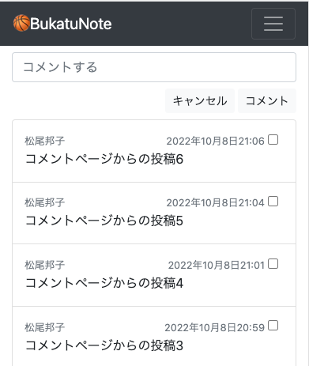

<!-- omit in toc -->
# コメント一覧ページからコメントを登録できるようにする

- [models](#models)
  - [base/models/item_comment_models.py](#basemodelsitem_comment_modelspy)
- [views](#views)
  - [base/views/item_views.py](#baseviewsitem_viewspy)
- [画面確認](#画面確認)

<br><br>

## models
### base/models/item_comment_models.py
target = models.ForeignKey(Item, on_delete=models.CASCADE, `null=True`)
targetはどの動画に対するコメントか.なので
今日の目標でコメント入力する時は、動画と紐づかないため`Nullも可能`とする
```python
    class Comment(models.Model):
        """動画に紐づくコメント、今日の目標コメント"""

        comment_text = models.CharField(default='', max_length=1000) # コメント
        author = models.ForeignKey(User, on_delete=models.CASCADE) # 投稿者Userモデルpk
-       target = models.ForeignKey(Item, on_delete=models.CASCADE) # 対象動画Itemモデルpk
+       target = models.ForeignKey(Item, on_delete=models.CASCADE, null=True) # 対象動画Itemモデルpk
        created_at = models.DateTimeField(auto_now_add=True) # 作成日 自動作成
        updated_at = models.DateTimeField(auto_now=True) ## 更新日 自動作成

        def __str__(self):
            return self.comment_text[:20]
```

## views
### base/views/item_views.py
- CommentListViewは作り直す(コメント一覧ページに投稿フォームを入れるため)
- ItemDetailViewと考え方は同じ

```python
# class CommentListView(ListView):
#     model = Comment
#     template_name = 'pages/comment.html'

class CommentListView(ModelFormMixin, ListView):
    model = Comment
    template_name = 'pages/comment.html'
    # context_object_name = 'comment_objects'
    form_class = CommentCreateForm
    success_url = reverse_lazy('comment')

    def get(self, request, *args, **kwargs):
        self.object = None
        return super().get(request, *args, **kwargs)

    def post(self, request, *args, **kwargs):
        self.object = None
        self.object_list = self.get_queryset()
        form = self.get_form()

        def form_valid(self, form):
            comment = form.save(commit=False)
            comment.author = self.request.user
            comment.save()
            return HttpResponseRedirect(reverse('comment'))

        if form.is_valid():
            return form_valid(self, form)
        else:
            return self.form_invalid(form)
```

## 画面確認
コメント登録フォームとコメント一覧がページにおさまっている<br>



