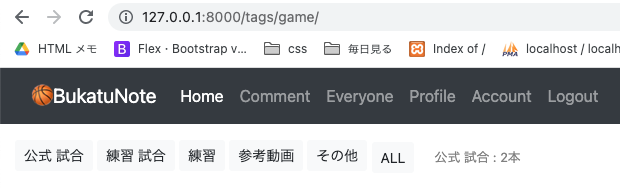

<!-- omit in toc -->
# everyone_comment.htmlとタグ関係
- everyone_comment.htmlの作成
  全員のコメントが見れるページ<br>
  今後はスーパーユーザー（先生、管理者）だけが見れるようにするか...
- タグ関係(些細)

- [everyone_comment.htmlとタグ関係](#everyone_commenthtmlとタグ関係)
  - [views](#views)
    - [base/views/item_views.py](#baseviewsitem_viewspy)
  - [config/urls.py](#configurlspy)
  - [templates](#templates)
    - [templates/snippets/header.html](#templatessnippetsheaderhtml)
    - [templates/pages/everyone_comment.html　作成](#templatespageseveryone_commenthtml作成)
- [選択しているタグの名前をテンプレートに表示させる](#選択しているタグの名前をテンプレートに表示させる)
  - [views](#views-1)
    - [base/views/item_views.py](#baseviewsitem_viewspy-1)
  - [templates](#templates-1)
    - [templates/pages/index.html](#templatespagesindexhtml)
  - [画面確認 OK!](#画面確認-ok)


<br><br>

# everyone_comment.htmlとタグ関係
- everyone_comment.htmlの作成
  全員のコメントが見れるページ<br>
## views
### base/views/item_views.py
```python
# 下に追加
class EveryoneCommentListView(LoginRequiredMixin, ListView):
    model = Comment
    template_name = 'pages/everyone_comment.html'
```

## config/urls.py
```python
    from django.contrib import admin
    from django.urls import path
    from base import views
    from django.contrib.auth.views import LogoutView # 追加 viewは自作せずdjangoの機能を使う

    urlpatterns = [
        path('admin/', admin.site.urls),

        path('', views.IndexListView.as_view()),  # トップページ
        path('comment/', views.CommentListView.as_view(), name="comment"),  # 自分のコメントページ
+       path('everyone/', views.EveryoneCommentListView.as_view()),  # 自分のコメントページ
        path('items/<str:pk>/', views.ItemDetailView.as_view(), name="item_detail"),
        path('tags/<str:pk>/', views.TagListView.as_view()), # 選択タグの動画表示

        # Account 追加
        path('login/', views.Login.as_view()),
        path('logout/', LogoutView.as_view()),
        path('signup/', views.SignUpView.as_view()),
        path('account/', views.AccountUpdateView.as_view()),
        path('profile/', views.ProfileUpdateView.as_view()),
    ]
```

## templates
### templates/snippets/header.html
```html
...
    <div class="collapse navbar-collapse" id="navbarNavAltMarkup">
      <div class="navbar-nav">
        <a class="nav-item nav-link active" href="/">Home</a>
        <a class="nav-link" href="/comment/">Comment</a>
+       <a class="nav-link" href="/everyone/">Everyone</a>
        <a class="nav-link" href="/profile/">Profile</a>
        <a class="nav-link" href="/account/">Account</a>
        <!-- ログインしているか、していないかで出しわけ -->
        
        <a class="nav-link" href="/logout/">Logout</a>
        
        <a class="nav-link" href="/login/">Login</a>
        <a class="nav-link" href="/signup/">SignUp</a>
        
      </div>
    </div>
...
```

### templates/pages/everyone_comment.html　作成

comment.htmlとちがいは、` *1`がないこと<br>
*1: ログインユーザーが記事の投稿者(Itemオブジェクトのauthor)だったら表示する

```html
<!-- comment.htmlの記述 -->


```

```html
<!-- everyone_comment.html -->





<div class="container my-2">

  <ol class="list-group list-group-numbered">
    
    <li class="list-group-item">
      <div class=" container-fluid">
        <div class="row justify-content-between">
          <div class="col-5">
            <small class="text-muted">{{object.author.profile.name}}</small>
          </div>
          <div class="col-7  text-right">

            <small class="text-muted mr-4">{{object.updated_at}}</small>
            <input class="form-check-input" type="checkbox" value="" id="flexCheckDefault">
          </div>
        </div>
        <p class="mb-1">{{object.comment_text}}</p>
      </div>
    </li>
    
  </ol>
</div>


```

<br><br>

# 選択しているタグの名前をテンプレートに表示させる
## views
### base/views/item_views.py

```python
    class TagListView(IndexListView, ListView):
        paginate_by = 8
        # paginate_by = 2 # テスト用

        def get_queryset(self): # get_queryset の上書き
            self.tag = Tag.objects.get(slug=self.kwargs['pk'])
            return Item.objects.filter(tags=self.tag)

        def get_context_data(self, *args, **kwargs):
            context = super().get_context_data(*args, **kwargs)
            context['total_item'] = Item.objects.filter(tags=self.tag).count()
+           self.tag = Tag.objects.get(slug=self.kwargs['pk'])
+           context['tag_name'] = self.tag.name
            return context
```

## templates
### templates/pages/index.html
```html
    

    

    <div class="container-fluid my-3">
      <!-- Tagモデルの全てを取得 -->
      
      <a href="/tags/{{tag.slug}}/" class="btn btn-light btn-sm mb-1">{{ tag.name }}</a>
      
      <a href="/" class="btn btn-light btn-sm">ALL</a>
+     <small class="ml-3">{{tag_name}} : {{total_item}}本</small>
    </div>

    <div class="container" style="max-width:100%">
      <div class="row mt-2 mb-5">
        
        <div class="col-12 col-lg-3 my-1">
          
        </div>
        
      </div>
    </div>

    <!-- ページング処理の部分 -->
    <div class="container">
      
    </div>

    
```

## 画面確認 OK!

