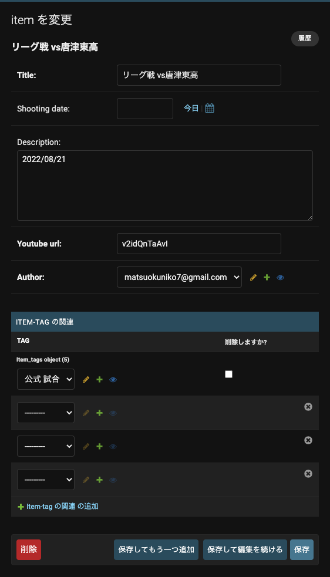
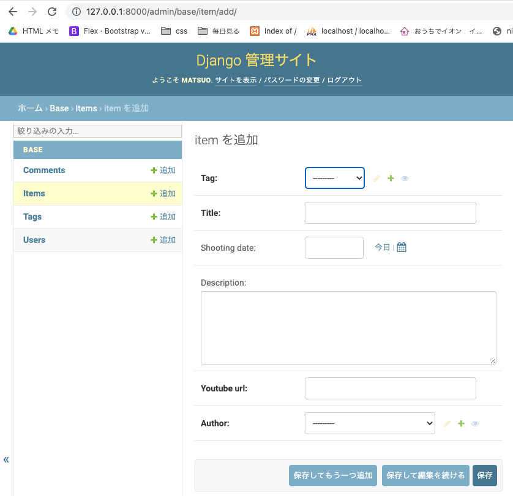
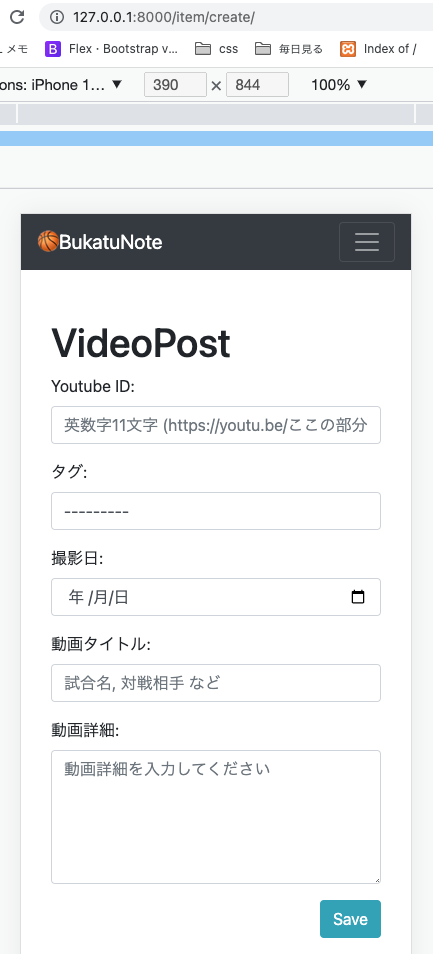
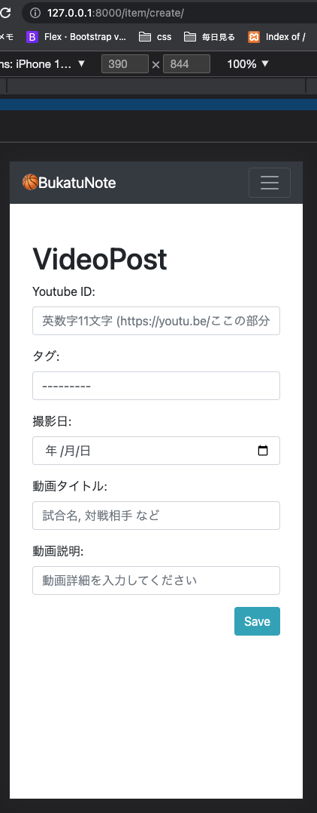
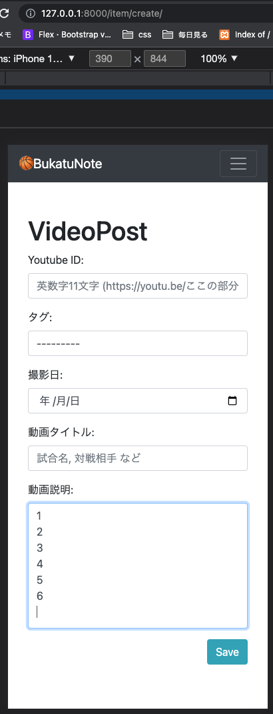

<!-- omit in toc -->
# Itemモデル(動画アイテム)登録ページ作成,モデルの再構築,再構築時のエラー対応,ModelFormからcreate
02_モデルの後にやるべきでしたw

- [models Itemモデルの再構築](#models-itemモデルの再構築)
  - [models Itemモデルの再構築](#models-itemモデルの再構築-1)
    - [base/models/item_models.py](#basemodelsitem_modelspy)
    - [エラー対応](#エラー対応)
    - [base/models/account_models.py](#basemodelsaccount_modelspy)
    - [カラムを増やしたことでのエラー対応](#カラムを増やしたことでのエラー対応)
      - [makemigrationsでのエラーメッセージ](#makemigrationsでのエラーメッセージ)
      - [defaultに管理者のmatsuoで埋める. python shellでユーザーidを調べる](#defaultに管理者のmatsuoで埋める-python-shellでユーザーidを調べる)
        - [カスタムしていないユーザーの呼び出し方(参考)](#カスタムしていないユーザーの呼び出し方参考)
        - [カスタムユーザーの呼び出し方](#カスタムユーザーの呼び出し方)
      - [non-nullable列にdefault値を入れて、makemigrations](#non-nullable列にdefault値を入れてmakemigrations)
    - [画面で確認](#画面で確認)
    - [Item.tagsの変更](#itemtagsの変更)
      - [base/models/item_models.py](#basemodelsitem_modelspy-1)
      - [base/admin.py](#baseadminpy)
    - [TagListViewの修正(省略)](#taglistviewの修正省略)
    - [画面で確認](#画面で確認-1)
- [ModelFormを使って動画投稿ページを作る](#modelformを使って動画投稿ページを作る)
  - [forms](#forms)
    - [base/forms/__ init __.py](#baseforms__-init-__py)
    - [base/forms/item_forms.py](#baseformsitem_formspy)
  - [views](#views)
    - [base/views/item_views.py](#baseviewsitem_viewspy)
  - [config/urls.py](#configurlspy)
  - [templates](#templates)
    - [templates/pages/comment.html](#templatespagescommenthtml)
    - [templates/snippets/header.html](#templatessnippetsheaderhtml)
    - [画面確認](#画面確認)
  - [改行で自動で大きさが変わるtextarea](#改行で自動で大きさが変わるtextarea)
    - [参考コード](#参考コード)
    - [実装](#実装)
      - [templates/pages/item_create.html](#templatespagesitem_createhtml)
      - [static/css/style.css](#staticcssstylecss)
      - [static/js/script.js](#staticjsscriptjs)
      - [base/forms/item_forms.py](#baseformsitem_formspy-1)
    - [画面の確認](#画面の確認)
    - [エラー 複数の「onloadイベント」書いてしまうと上書きされてしまい、最後に書いたイベントだけが実行されるという仕様](#エラー-複数のonloadイベント書いてしまうと上書きされてしまい最後に書いたイベントだけが実行されるという仕様)

<br><br>

# models Itemモデルの再構築
## models Itemモデルの再構築
- Itemモデルの再構築。撮影日と登録者を追加する
- `create_id関数の移動(詳細エラー対応をみる)`
- youtubeIDと動画説明に文字数制限

### base/models/item_models.py
```python
    from django.db import models
-   from django.utils.crypto import get_random_string #ランダム文字列作成 id用
+   from base.models import create_id # item_models.py のcreate_id関数(22文字のランダムな文字列を作る)
+   from .account_models import User


-   def create_id():
-       return get_random_string(22) # 22文字のランダムな文字列を作る
-   # idをランダムにすると、ユーザーに予測がされにくくい


    class Tag(models.Model):
        slug = models.CharField(max_length=32, primary_key=True) # slug:id
        name = models.CharField(max_length=32)

        def __str__(self):
            return self.name


    class Item(models.Model):
        # default=create_id 関数を呼び出す
        # editable=False 修正不可(管理画面でも)
    id = models.CharField(default=create_id, primary_key=True, max_length=22, editable=False)
    tag =models.ForeignKey(Tag, on_delete=models.CASCADE)
    title = models.CharField(default='', max_length=200) # タイトル 試合内容＆対戦相手
+   shooting_date = models.DateField(blank=True, null=True) # 撮影日
    description = models.TextField(default='', blank=True, max_length=1000) # 説明(詳細)
    youtube_url = models.CharField(default='', max_length=11) # youtube idのみ登録
-   author = models.ForeignKey(User, on_delete=models.CASCADE) # 投稿者Userモデルpk
    created_at = models.DateTimeField(auto_now_add=True) # 作成日 自動作成
    updated_at = models.DateTimeField(auto_now=True) ## 更新日 自動作成


        def __str__(self):
            return self.title
```

### エラー対応
Userモデルには変更はないけど、ItemモデルでUserを読み出すのに、item_models.pyのcreate_id関数をUserモデルで使っていて、回遊して読み込めないエラーが出たので、`create_id関数をitem_models.py -> account_models.pyへ移動`させる<br><br>
__エラーメッセージ__
```python
(myvenv) niko@kunikonoMacBook-Pro basketball-tube % python manage.py makemigrations base
# エラーが出た
# 内容: 回遊してるから呼び出せないよ
ImportError: cannot import name 'create_id' from partially initialized module 'base.models.item_models' (most likely due to a circular import) (/Users/niko/Desktop/MyApp/Django/basketball-tube/base/models/item_models.py)
```

### base/models/account_models.py
```python
    from django.dispatch import receiver
    from django.db.models.signals import post_save
    from django.db import models
    from django.contrib.auth.models import BaseUserManager, AbstractBaseUser
-   from base.models import create_id
+   from django.utils.crypto import get_random_string #ランダム文字列作成 id用


+   def create_id():
+       return get_random_string(22) # 22文字のランダムな文字列を作る
+   # idをランダムにすると、ユーザーに予測がされにくくい
```

<br><br>

### カラムを増やしたことでのエラー対応
登録者枠を増やしたが、すでにデータベースに入っているものが空白のため空白を埋めなさいというエラー<br>
すでにデータベースにあるものにはdefault値を設定する。今回は空白の登録者は、matsuoにする

#### makemigrationsでのエラーメッセージ
```python
(myvenv) niko@kunikonoMacBook-Pro basketball-tube % python manage.py makemigrations base
# メッセージが出た
# デフォルトを指定せずに、null 値でないフィールド 'author' をアイテムに追加することはできません。これは、データベースが既存の行を埋めるために何かを必要とするためです。
# 修正方法を選択してください。
#  1) 一度限りのデフォルトを提供する (このカラムにヌル値がある既存のすべての行に設定されます)
#  2) 終了して、models.py で手動でデフォルト値を定義します。
# オプションを選択してください。
It is impossible to add a non-nullable field 'author' to item without specifying a default. This is because the database needs something to populate existing rows.
Please select a fix:
 1) Provide a one-off default now (will be set on all existing rows with a null value for this column)
 2) Quit and manually define a default value in models.py.
Select an option: 1
```

#### defaultに管理者のmatsuoで埋める. python shellでユーザーidを調べる

1を選択して、defaultに管理者のmatsuoで埋めたいが、idがわからないので調べる
ユーザーオブジェクトをターミナルで呼び出す

##### カスタムしていないユーザーの呼び出し方(参考)
```python
>>> from django.contrib.auth.models import User
>>> User.objects.all()
```

##### カスタムユーザーの呼び出し方
settings.pyで`AUTH_USER_MODEL = 'base.User'`とカスタムユーザーを使うと指定している
```python
# シェルに入る
(myvenv) niko@kunikonoMacBook-Pro basketball-tube % python3 manage.py shell
# カスタムユーザーを呼び出す
>>> from base.models import User
>>> User.objects.all()
<QuerySet [<User: test@gmail.com>, <User: matsuokuniko7@gmail.com>]>
>>> users = User.objects.all()
>>> len(users)
2
>>> user=users[1]
>>> user
<User: matsuokuniko7@gmail.com>
>>> user.id
'SpHM8OcbE5WTyPUuvC9Bhf'
>>>
```

#### non-nullable列にdefault値を入れて、makemigrations

```python
(myvenv) niko@kunikonoMacBook-Pro basketball-tube % python manage.py makemigrations base
It is impossible to add a non-nullable field 'author' to item without specifying a default. This is because the database needs something to populate existing rows.
Please select a fix:
 1) Provide a one-off default now (will be set on all existing rows with a null value for this column)
 2) Quit and manually define a default value in models.py.
# 1を選ぶ
Select an option: 1
Please enter the default value as valid Python.
The datetime and django.utils.timezone modules are available, so it is possible to provide e.g. timezone.now as a value.
Type 'exit' to exit this prompt
# defaultにmatsuokuniko7@gmail.comのidをセットする
>>> 'SpHM8OcbE5WTyPUuvC9Bhf'
Migrations for 'base':
  base/migrations/0008_item_author_item_shooting_date.py
    - Add field author to item
    - Add field shooting_date to item
(myvenv) niko@kunikonoMacBook-Pro basketball-tube % python manage.py migrate
Operations to perform:
  Apply all migrations: admin, auth, base, contenttypes, sessions
Running migrations:
  Applying base.0008_item_author_item_shooting_date... OK
(myvenv) niko@kunikonoMacBook-Pro basketball-tube % python manage.py runserver
```

### 画面で確認
撮影日(Shooting date:)と登録者(Author:)ができている。登録者はmatsuoになっている<br>
確認 OK!<br>


<br><br>

### Item.tagsの変更
models.ManyToManyField -> ForeignKeyへ変更

#### base/models/item_models.py
```python
# 変更前
tags = models.ManyToManyField(Tag) # タグは複数付けれるので複数形
# 変更後
tag =models.ForeignKey(Tag, on_delete=models.CASCADE)
```

#### base/admin.py
Tagモデルのインライン部分を削除
```python
    from xml.etree.ElementTree import Comment
    from django.contrib import admin
    from django.contrib.auth.models import Group  # 元からあるグループ
    from base.models import Item, Tag, User, Profile, Comment #追加
    from base.forms import UserCreationForm #追加
    from django.contrib.auth.admin import UserAdmin #追加

-   class TagInline(admin.TabularInline):
-       model = Item.tags.through

-   class ItemAdmin(admin.ModelAdmin):
-       inlines = [TagInline] # クラスTagInlineをinlinesに渡す
-       exclude = ['tags']    # モデル作成時に作った'tags'をexclude(除外)する

    # カスタムユーザー用
    class ProfileInline(admin.StackedInline):
        model = Profile
        can_delete = False
    class CustomUserAdmin(UserAdmin):
        # 管理画面に表示するもの. 2段に分けて表示
        fieldsets = (
            (None, {'fields': ('username', 'email', 'password',)}),
            (None, {'fields': ('is_active', 'is_admin',)}),
        )

        list_display = ('username', 'email', 'is_active',)
        list_filter = ()
        ordering = () # 一覧表示の並び替えのキーの設定ができる 今回未使用
        filter_horizontal = ()

        # 管理画面でユーザーを作成するときに使う項目の設定
        add_fieldsets = (
            (None, {'fields': ('username', 'email', 'is_active',)}),
        )

        # 管理画面でも自作のフォームが使える
        add_form = UserCreationForm
        # 管理画面のユーザーページに同じユーザーのプロフィールを入れる
        inlines = (ProfileInline,)


-   admin.site.register(Item, ItemAdmin)     # 管理者画面にモデルを反映させる
+   admin.site.register(Item)     # 管理者画面にモデルを反映させる
    admin.site.register(Tag)
    admin.site.register(Comment)
    admin.site.register(User, CustomUserAdmin) # カスタムユーザーで追加
    admin.site.unregister(Group)  # 元からある[グループ]を使わないので非表示に設定

    # register　　...表示
    # unregister ...非表示
```

### TagListViewの修正(省略)

### 画面で確認
Item.tagがテーブルの中に入っている<br>
確認 OK!<br>


<br><br>

# ModelFormを使って動画投稿ページを作る
[Djangoドキュ: モデルからフォームを作成する](https://docs.djangoproject.com/en/4.1/topics/forms/modelforms/#modelforms-factory)
## forms
### base/forms/__ init __.py
```python
    from .account_forms import *
    from .item_comment_forms import *
+   from .item_forms import *
    # modelsを呼び出せば、item_comment_forms.pyも呼び出せる
```

### base/forms/item_forms.py
```python
from django import forms
from base.models import Item


class ItemCreateForm(forms.ModelForm):
    """動画投稿フォーム"""

    class Meta:
        model = Item
        fields  = ('youtube_url', 'tag', 'shooting_date', 'title', 'description', )
        labels = {'tag':'タグ', 'title':'動画タイトル', 'shooting_date':'撮影日', 'description':'動画詳細', 'youtube_url':'Youtube ID',}
        widgets = {
            'youtube_url': forms.TextInput(
                attrs={'class': 'form-control mb-3  col-md-4', 'placeholder': '英数字11文字 (https://youtu.be/ここの部分)',}),
            'tag': forms.Select(
                attrs={'class': 'form-select mb-3 col-md-4',}),
            'shooting_date': forms.DateTimeInput(
                attrs={'class': 'form-control mb-3  col-md-4','type':'date',}),
            'title': forms.TextInput(
                attrs={'class': 'form-control mb-3', 'placeholder': '試合名, 対戦相手 など',}),
            'description': forms.Textarea(
                attrs={'class': 'form-control mb-3','rows': '5', 'placeholder': '動画詳細を入力してください',}),
        }
```

<br><br>

## views
### base/views/item_views.py
```python
class ItemCreateView(LoginRequiredMixin, CreateView):
    model = Item
    template_name = 'pages/item_create.html'
    form_class = ItemCreateForm

    # form_valid関数をオーバーライドすることで、更新するフィールドと値を指定できる
    def form_valid(self, form):
        item = form.save(commit=False)
        item.author = self.request.user
        item.save()
        return HttpResponseRedirect(reverse('item_create'))
```

<br><br>

## config/urls.py
```python
    ...
    path('', views.IndexListView.as_view()),  # トップページ
    path('comment/', views.CommentListView.as_view(), name="comment"),  # 自分のコメントページ
+   path('item/create/', views.ItemCreateView.as_view(), name="item_create"),  # 動画投稿ページ
    path('everyone/', views.EveryoneCommentListView.as_view()),  # 自分のコメントページ
    path('items/<str:pk>/', views.ItemDetailView.as_view(), name="item_detail"),
    path('tags/<str:pk>/', views.TagListView.as_view()), # 選択タグの動画表示
    ...
```

<br><br>

## templates
### templates/pages/comment.html
```html




<div class="container my-5">
  <div class="col-12">
    <h1>VideoPost</h1>
    <form method="POST">
      
      {{form}}
      <div class="text-right mb-3">
        <button type="submit" class="btn btn-info btm-sm">Save</button>
      </div>
    </form>
  </div>
</div>
</div>


```

### templates/snippets/header.html
```html
    ...
    <div class="navbar-nav">
      <a class="nav-item nav-link active" href="/">Home</a>
      <a class="nav-link" href="/comment/">Comment</a>
+     <a class="nav-link" href="/item/create/">VideoPost</a>
      <a class="nav-link" href="/everyone/">Everyone</a>
      <a class="nav-link" href="/profile/">Profile</a>
      <a class="nav-link" href="/account/">Account</a>
      <!-- ログインしているか、していないかで出しわけ -->
      
      <a class="nav-link" href="/logout/">Logout</a>
      
      <a class="nav-link" href="/login/">Login</a>
      <a class="nav-link" href="/signup/">SignUp</a>
      
    </div>
    ...
```

### 画面確認
OK ! <br>
Itemの保存確認、index.htmlへの表示も確認すみ<br>


<br><br>

## 改行で自動で大きさが変わるtextarea
Item.description(動画詳細)は、textareaです<br>
textareaを改行に応じて自動で高さが変わるようにします<br>
入力イベント(oninput)時に、textareaの行の高さ × 行数(改行文字数)でheightを変えることで実装しています<br>
コードは数行で、HTML, CSS, JSのみで簡単に実装<br>
### 参考コード
[参考url: 改行で自動で大きさが変わるtextareaの作り方](https://zenn.dev/cigar/articles/textarea-variable-size)

```html
<textarea id="textarea" placeholder="改行で高さが変わるtextarea" rows='1' oninput="resizeTextarea()"></textarea>
```

```css
#textarea {
  resize: none;
  line-height: 1.5;
  width: 100%;
}
```

```js
window.onload = function() {

  //- 改行に合わせてテキストエリアのサイズ変更
  this.resizeTextarea = () => {

    // textarea要素のpaddingのY軸(高さ)
    const PADDING_Y = 20;

    // textarea要素
    const $textarea = document.getElementById("textarea");

    // textareaそ要素のlineheight
    let lineHeight = getComputedStyle($textarea).lineHeight;
    // "19.6px" のようなピクセル値が返ってくるので、数字だけにする
    lineHeight = lineHeight.replace(/[^-\d\.]/g, '');

    // textarea要素に入力された値の行数
    const lines = ($textarea.value + '\n').match(/\n/g).length;

    // 高さを再計算
    $textarea.style.height = lineHeight * lines + PADDING_Y + 'px';
  };
};
```

### 実装
class ItemCreateForm(forms.ModelForm)で作られたtextareaは自動でidが作られる`id="id_description"`ので<br>
- cssとjsのid名を変更
- item_forms.pyのwidgets変更


#### templates/pages/item_create.html
htmlは変更不要　出来上りの参考にコード載せます
```html
<textarea
  name="description"
  cols="40"
  rows="1"
  class="form-control mb-3"
  placeholder="動画詳細を入力してください"
  oninput="resizeTextarea()"
  maxlength="1000"
  id="id_description">
</textarea>
```

#### static/css/style.css
id名を変更
```css
#id_description {
  resize: none;
  line-height: 1.5;
  width: 100%;
  /* padding: 10; */
}
```

#### static/js/script.js
id名を変更
```js
...
const $textarea = document.getElementById("id_description");
...
```

#### base/forms/item_forms.py
設定の追加
```python
...
widgets = {
    'description': forms.Textarea(
        attrs={'class': 'form-control mb-3', 'placeholder': '動画詳細を入力してください', 'rows':'1', 'oninput':"resizeTextarea()"}),
}
...
```

### 画面の確認

最初は1行で表示されるが、入力しながら行数が増えて、高さが広がる<br>



### エラー 複数の「onloadイベント」書いてしまうと上書きされてしまい、最後に書いたイベントだけが実行されるという仕様
`addEventListener`を使う
```js
window.onload = function() {
    console.log('ミカン');
}
window.onload = function() {
    console.log('バナナ');
}
window.onload = function() {
    console.log('メロン');
}

// メロン
```

```js
window.addEventListener('load', function() {
  console.log('リンゴ');
})
window.addEventListener('load', function() {
  console.log('バナナ');
})
window.addEventListener('load', function() {
  console.log('メロン');
})

// リンゴ
// バナナ
// メロン
```