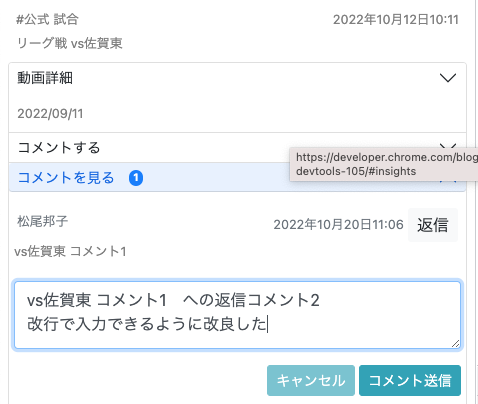
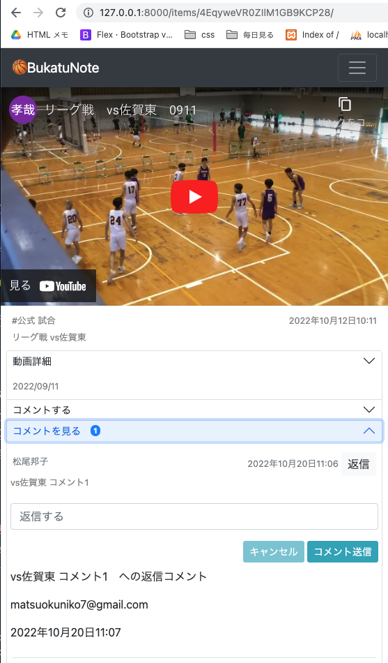

<!-- omit in toc -->
# コメント返信の実装
<!-- omit in toc -->
# Djagnoで複数フォームを1テンプレート内に表示する方法<br>
__テンプレートはDetailViews__<br>
動画に対してのコメント、コメントに対しての返信コメントの実装





- [models](#models)
  - [base/models/item_comment_models.py](#basemodelsitem_comment_modelspy)
    - [Replyモデル作成](#replyモデル作成)
    - [マイグレーション、マイグレードする(省略)](#マイグレーションマイグレードする省略)
- [base/admin.py](#baseadminpy)
  - [Replyモデルを管理画面に追加](#replyモデルを管理画面に追加)
- [forms](#forms)
  - [base/forms/item_comment_forms.py](#baseformsitem_comment_formspy)
    - [ReplyCreateFormクラス作成](#replycreateformクラス作成)
- [templates](#templates)
  - [説明](#説明)
    - [テンプレートで動画に紐づくComment一覧, コメントに紐づくReply一覧の表示](#テンプレートで動画に紐づくcomment一覧-コメントに紐づくreply一覧の表示)
    - [viewからテンプレートへformを呼び出す](#viewからテンプレートへformを呼び出す)
    - [参考：検証画面（テンプレート表示内容）](#参考検証画面テンプレート表示内容)
  - [全体 templates/pages/item_detail.html](#全体-templatespagesitem_detailhtml)
- [views](#views)
  - [説明](#説明-1)
    - [formを二つに増やす](#formを二つに増やす)
    - [テンプレートの送信ボタンを押されてからの動きを2つ作る](#テンプレートの送信ボタンを押されてからの動きを2つ作る)
  - [全体 base/views/item_views.py](#全体-baseviewsitem_viewspy)
- [Javascript](#javascript)
  - [返信コメントもtextareaが拡大していけるようにする](#返信コメントもtextareaが拡大していけるようにする)
- [参考url](#参考url)

# models
## base/models/item_comment_models.py
### Replyモデル作成
CommentモデルとReplyモデルに管理しやすいように、自動連番取得でidを作る<br>
　　　　 `id = models.AutoField(primary_key=True)`<br>
Replyモデルでは、ForeignKeyを3つ作る（Commentモデル、Itemモデル、Userモデル）

```python
    from django.db import models
    from .account_models import User
    from .item_models import Item


    class Comment(models.Model):
        """動画に紐づくコメント、今日の目標コメント(最初のコメント)"""
+       id = models.AutoField(primary_key=True)
        comment_text = models.TextField(default='', max_length=1000) # コメント
        author = models.ForeignKey(User, on_delete=models.CASCADE) # 投稿者Userモデルpk
        # author = models.ForeignKey(Profile, on_delete=models.CASCADE) # 投稿者Userモデルpk
        target = models.ForeignKey(Item, on_delete=models.CASCADE, null=True) # 対象動画Itemモデルpk
        created_at = models.DateTimeField(auto_now_add=True) # 作成日 自動作成
        updated_at = models.DateTimeField(auto_now=True) ## 更新日 自動作成

        def __str__(self):
            return self.comment_text[:20]


+   class Reply(models.Model):
+       """コメントに紐づくコメント(コメント返信)"""
+       id = models.AutoField(primary_key=True)
+       comment_to = models.ForeignKey(Comment, on_delete=models.CASCADE) # 最初のコメントのpk
+       comment_text = models.TextField(default='', max_length=1000) # 返信コメント
+       author = models.ForeignKey(User, on_delete=models.CASCADE) # 投稿者Userモデルpk
+       target = models.ForeignKey(Item, on_delete=models.CASCADE, null=True) # 対象動画Itemモデルpk
+       created_at = models.DateTimeField(auto_now_add=True) # 作成日 自動作成
+       updated_at = models.DateTimeField(auto_now=True) ## 更新日 自動作成

+       def __str__(self):
+           return self.comment_text[:20]
```
### マイグレーション、マイグレードする(省略)


<br><br>

# base/admin.py
## Replyモデルを管理画面に追加

```python
    from xml.etree.ElementTree import Comment
    from django.contrib import admin
    from django.contrib.auth.models import Group  # 元からあるグループ
-   from base.models import Item, Tag, User, Profile, Comment
+   from base.models import Item, Tag, User, Profile, Comment, Reply #追加
    from base.forms import UserCreationForm #追加
    from django.contrib.auth.admin import UserAdmin #追加


    # カスタムユーザー用
    class ProfileInline(admin.StackedInline):
        model = Profile
        can_delete = False
    class CustomUserAdmin(UserAdmin):
        # 管理画面に表示するもの. 2段に分けて表示
        fieldsets = (
            (None, {'fields': ('username', 'email', 'password',)}),
            (None, {'fields': ('is_active', 'is_admin',)}),
        )

        list_display = ('username', 'email', 'is_active',)
        list_filter = ()
        ordering = () # 一覧表示の並び替えのキーの設定ができる 今回未使用
        filter_horizontal = ()

        # 管理画面でユーザーを作成するときに使う項目の設定
        add_fieldsets = (
            (None, {'fields': ('username', 'email', 'is_active',)}),
        )

        # 管理画面でも自作のフォームが使える
        add_form = UserCreationForm
        # 管理画面のユーザーページに同じユーザーのプロフィールを入れる
        inlines = (ProfileInline,)


    admin.site.register(Item)     # 管理者画面にモデルを反映させる
    admin.site.register(Tag)
    admin.site.register(Comment)
+   admin.site.register(Reply)
    admin.site.register(User, CustomUserAdmin) # カスタムユーザーで追加
    admin.site.unregister(Group)  # 元からある[グループ]を使わないので非表示に設定

    # register　　...表示
    # unregister ...非表示
```

<br><br>

# forms
## base/forms/item_comment_forms.py
### ReplyCreateFormクラス作成

- テンプレートからviewに値を渡すのでfieldsは設定するが、非表示設定する
  - 'comment_text'は、javascriptでCommentIDを使うので、テンプレートでIDを取得しjsに渡すので、ここでは非表示としてfieldを作っておく<br>
  - 'comment_to'は、ForeignKey(Comment)なので、入力しないが、値はテンプレートからviewに運ぶので、非表示としてfieldを作っておく<br>

```python
    from django import forms
-   from base.models import Comment
+   from base.models import Comment, Reply


    class CommentCreateForm(forms.ModelForm):
        """コメント投稿フォーム"""
        class Meta:
            model = Comment
            fields  = ('comment_text',)
            # ラベルは非表示にしないので空白で設定
            labels = {'comment_text': '',}
            widgets = {
                'comment_text': forms.Textarea(
                    attrs={'class': 'form-control my-3', 'placeholder': 'コメントする', 'rows':'1', 'oninput':'resizeCommentTextarea();', }),
            }


+   class ReplyCreateForm(forms.ModelForm):
+       """返信コメント投稿フォーム"""
+       class Meta:
+           model = Reply
+           fields  = ('comment_text', 'comment_to')
+           widgets = {
+               'comment_text': forms.HiddenInput(),
+               'comment_to': forms.HiddenInput(),
+           }

# 'comment_text'は、javascriptでCommentIDを使うので、テンプレートでIDを取得しjsに渡すので、ここでは非表示としてfieldを作っておく
# 'comment_to'は、ForeignKey(Comment)なので、入力しないが、値はテンプレートからviewに運ぶので、非表示としてfieldを作っておく```
```

<br><br>

# templates
## 説明
### テンプレートで動画に紐づくComment一覧, コメントに紐づくReply一覧の表示
- 動画に対するコメントの中に、返信の箱を入れる
- 動画に紐づくコメントを一覧で表示(Commentの表示) ``
- コメントに紐づく返信コメントを一覧で表示(Replyの表示)  ``
- コメントに紐づく返信コメントの数を表示(そのReplyの合計表示)  `{{ comment.reply_set.all.count }}`

```html
<!-- 動画に紐づくコメントを一覧で表示 -->

  <small class="text-muted">{{ comment.author.profile.name }}</small>
  <small class="text-muted">{{ comment.updated_at }}</small>
  <small class=" mb-1">{{ comment.comment_text| linebreaksbr}}</small>

  <!-- 返信コメントの箱 -->
  <div id="replyBox_{{ comment.id }}">
    <!-- 返信コメントフォーム -->
    <form method="POST">
      <!-- ...省略... -->
    </form>


    <!-- コメントに対する、返信コメントの一覧を出力 -->
    <p>{{ comment.reply_set.all.count }}</p>
    
    <p>{{ reply.comment_text | linebreaksbr }}</p>
    <p>{{ reply.author }}</p>
    <p>{{ reply.created_at }}</p>
    


```

### viewからテンプレートへformを呼び出す
- 2つのフォームを呼び出す<br>
    `{{ comment_form }}`, `{{ reply_form }}`<br>
- 送信ボタンで、フォームのバリデーションを行う動きをかえていくので、明示する<br>
    `CommentFormBtn`, `ReplyFormBtn`
- textareaの動き `oninput="resizeReplyTextarea(this);`と`id="id_comment_text_{{ comment.pk }}"`

```html
<!-- コメント投稿フォーム -->
<form method="POST">
  
  {{ comment_form }}

  <button type="submit" name="CommentFormBtn">コメント送信</button>
</form>

<!-- 返信コメント投稿フォーム -->
<form method="POST">
  
  <!-- このフォームはforms.pyで非表示設定。なので入力されない -->
  {{ reply_form }}

  <!-- comment.idを含んで、処理する部分 -->
  <textarea name="comment_text" cols="40" rows="1" class="form-control my-3" placeholder="返信する" oninput="resizeReplyTextarea(this);" maxlength="1000" required="" id="id_comment_text_{{ comment.pk }}"></textarea>
  <input type="hidden" name="comment_to" value="{{ comment.pk }}">

  <button type="submit" name="ReplyFormBtn">コメント送信</button>
</form>
```

### 参考：検証画面（テンプレート表示内容）
css部分を省略したもの
```html

<!-- 返信コメントの箱 -->
<div id="replyBox_60">

  <!-- 返信コメントフォーム -->
  <form method="POST">
    <input type="hidden" name="csrfmiddlewaretoken" value="Hi3Wuric4uaK7BeaK3k9XXRguS3u7oq87XzzDt90ohm9EDKjRDU5cpIspKxM79Ol">
    <!-- このフォームは非表示なので入力されない -->
    <input type="hidden" name="comment_text" id="id_comment_text"><input type="hidden" name="comment_to" id="id_comment_to">

    <!-- comment.idを含んで、処理する部分 -->
    <textarea name="comment_text" cols="40" rows="1" placeholder="返信する" oninput="resizeReplyTextarea(this);" maxlength="1000" required="" id="id_comment_text_60"></textarea>
    <input type="hidden" name="comment_to" value="60">


    <div class="text-right my-2">
      <button type="text" onclick="clearText()">キャンセル</button>
      <button type="submit"  name="ReplyFormBtn">コメント送信</button>
    </div>
  </form>

  <!-- コメントに対する、返信コメントの一覧を出力 -->

  <p>vs佐賀東 コメント1　への返信コメント</p>
  <p>matsuokuniko7@gmail.com</p>
  <p>2022年10月20日11:07</p>

  <p>vs佐賀東 コメント1　への返信コメント2<br>改行で入力できるように改良した</p>
  <p>matsuokuniko7@gmail.com</p>
  <p>2022年10月20日16:33</p>


</div>
```

## 全体 templates/pages/item_detail.html
css部分を省略したもの
```html
<!-- ...動画detail部分も省略 -->

<!-- コメント作成用 -->
<form method="POST">
  
  {{ comment_form }}

  <div class="text-right my-2">
    <button type="text" onclick="clearText()">キャンセル</button>
    <button type="submit" name="CommentFormBtn">コメント送信</button>
  </div>
</form>

<!-- 動画に紐づくコメントを一覧で表示 -->

  <small>{{ comment.author.profile.name }}</small>
  <small>{{ comment.updated_at }}</small>
  <small>{{ comment.comment_text| linebreaksbr}}</small>

  <!-- 返信コメントの箱 -->

  <div id="replyBox_{{ comment.id }}">
    <!-- 返信コメントフォーム -->
    <form method="POST">
      
      {{ reply_form }}

      <!-- 隠しデータを設定しておく部分 -->
      <input type="hidden" name="comment_to" value="{{ comment.pk }}">
      <div class="text-right my-2">
        <button type="text" onclick="clearText()">キャンセル</button>
        <button type="submit" name="ReplyFormBtn">コメント送信</button>
      </div>
    </form>

    <!-- コメントに対する、返信コメントの一覧を出力 -->
    
    <p>{{ reply.comment_text | linebreaksbr }}</p>
    <p>{{ reply.author }}</p>
    <p>{{ reply.created_at }}</p>
    


```

<br><br>

# views
## 説明
今までの ItemDetailView(ModelFormMixin, DetailView)クラスでは、<br>
`DetalViewでフォームを1つ`使っていたので、`DetalViewでフォームを2つ`使えるようにかえていく<br>

### formを二つに増やす
- form_classを2つ設定する
- Djangoの'form_class'で明記しない場合は、'fields = ()'を書いておかないとエラーになるので書いておく

```Python
# 今回 (formが 2つ)
comment_form_class = CommentCreateForm
reply_form_class = ReplyCreateForm
fields = ()

# 前回 (formが 1つ)
form_class = CommentCreateForm
```

- Formの取得を2つ明記(djangoドキュメントよりget_form()の動きを確認した)
```python
# 今回 (formが 2つ)
def post(self, request, *args, **kwargs):
    cform = CommentCreateForm(**self.get_form_kwargs()) # Formを取得
    rform = ReplyCreateForm(**self.get_form_kwargs()) # Formを取得
    self.object = self.get_object() # Itemのこと

# 前回 (formが 1つ)
def post(self, request, *args, **kwargs):
    form = self.get_form() # Formを取得
    self.object = self.get_object() # Itemのこと
```

- テンプレートに渡すフォームの明示
  formが1つのとき、form_classで指定することで、formで呼び出せていた<br>
  formが2つになったので、contextを上書きで指定する。<br>
  テンプレートでは、comment_formとreply_formで呼び出す<br>

```python
# 今回 (formが 2つ)
def get_context_data(self, *args, **kwargs):
    comment_form = self.comment_form_class(self.request.GET or None)
    reply_form = self.reply_form_class(self.request.GET or None)
    context.update({
        'comment_form': comment_form,
        'reply_form':reply_form
    })
    return context

# 前回 (formが 1つ)
なし
```

### テンプレートの送信ボタンを押されてからの動きを2つ作る

- どのformからpost送信されたかで、動きを作る<br>
  viewsの `if 'CommentFormBtn' in request.POST:` と<br>
  templateの `<button type="submit" name="CommentFormBtn">コメント送信</button>`
- form_invalid(form)の動き(djangoドキュメント form_invalid ()を確認した)<br>
  Djangoでは1つしかformを返さないので、2つのformを返すように変える
    ```python
    # ドキュメント
    def form_invalid(self, form):
        """フォームが無効な場合、無効なフォームをレンダリングする"""
        return self.render_to_response(self.get_context_data(form=form))
    ```

```python
# 今回 (formが 2つ)
if 'CommentFormBtn' in request.POST:
    if cform.is_valid():
        return cform_valid(self, cform)
    else:
        return self.render_to_response(self.get_context_data())

# 前回 (formが 1つ)
if form.is_valid():
    return form_valid(self, form)
else:
    return self.form_invalid(form)
```

```html
<!-- コメント作成用 -->
<form method="POST">
  
  {{ comment_form }}

  <div class="text-right my-2">
    <button type="text" onclick="clearText()">キャンセル</button>
    <button type="submit" name="CommentFormBtn">コメント送信</button>
  </div>
</form>
```

<br><br>

## 全体 base/views/item_views.py
```python
class ItemDetailView(ModelFormMixin, DetailView):
    """
    個別の動画ページ(item_detail.html)
    動画(Itemモデル)DetailViewとコメント投稿フォーム
    投稿->保存->リダイレクト
    """
    model = Item
    template_name = 'pages/item_detail.html'
    context_object_name = 'item'
    comment_form_class = CommentCreateForm
    reply_form_class = ReplyCreateForm
    fields = ()


    # no get_context_data override
    def post(self, request, *args, **kwargs):
        # first construct the form to avoid using it as instance
        cform = CommentCreateForm(**self.get_form_kwargs()) # Formを取得
        rform = ReplyCreateForm(**self.get_form_kwargs()) # Formを取得
        # form = self.get_form() # Formを取得
        self.object = self.get_object() # Itemのこと

        def cform_valid(self, cform):
            item = get_object_or_404(Item, pk=self.object.pk)
            comment = cform.save(commit=False)
            comment.target = item
            comment.author = self.request.user
            comment.save()
            return HttpResponseRedirect(self.get_success_url())

        def rform_valid(self, rform):
            item = get_object_or_404(Item, pk=self.object.pk)
            reply = rform.save(commit=False)
            reply.target = item
            reply.author = self.request.user
            reply.save()
            return HttpResponseRedirect(reverse('item_detail', kwargs={'pk': self.object.pk}))

        if 'CommentFormBtn' in request.POST:
            print('CommentFormBtnボタン押した')
            if cform.is_valid():
                return cform_valid(self, cform)
            else:
                return self.render_to_response(self.get_context_data())

        if 'ReplyFormBtn' in request.POST:
            if rform.is_valid():
                return rform_valid(self, rform)
            else:
                return self.render_to_response(self.get_context_data())

    def get_success_url(self):
        return reverse('item_detail', kwargs={'pk': self.object.pk})

    # 動画に紐づいたコメント数を返す
    def get_context_data(self, *args, **kwargs):
        context = super().get_context_data(*args, **kwargs)
        item = get_object_or_404(Item, pk=self.object.pk)
        self.target = item.pk
        context['comment_count'] = Comment.objects.filter(target=self.target).count()
        comment_form = self.comment_form_class(self.request.GET or None)
        reply_form = self.reply_form_class(self.request.GET or None)
        context.update({
            'comment_form': comment_form,
            'reply_form':reply_form
        })
        return context
```

<br><br>

# Javascript
## 返信コメントもtextareaが拡大していけるようにする
- 返信はコメントごとにformがあるので、idの取得が必要になる
```js
// Replyは一つのテンプレートに複数あるので、idを取得して、getElementByIdする
function resizeReplyTextarea(ele){
  //- 改行に合わせてテキストエリアのサイズ変更
  var id_value = ele.id; // eleのプロパティとしてidを取得
  const PADDING_Y = 20;
  const $textarea = document.getElementById(id_value);
  let lineHeight = getComputedStyle($textarea).lineHeight;
  lineHeight = lineHeight.replace(/[^-\d\.]/g, '');
  const lines = ($textarea.value + '\n').match(/\n/g).length;
  $textarea.style.height = lineHeight * lines + PADDING_Y + 'px';
}
```

参考(前回作ったCommentのTextarea) <br>
basketball-tube/memo/14_Itemモデル登録ページ作成.md
```js
// 前回作ったCommentのTextarea
window.addEventListener('load', function() {
  //- 改行に合わせてテキストエリアのサイズ変更
  this.resizeCommentTextarea = () => {
    const PADDING_Y = 20;
    const $textarea = document.getElementById("id_comment_text");
    let lineHeight = getComputedStyle($textarea).lineHeight;
    lineHeight = lineHeight.replace(/[^-\d\.]/g, '');
    const lines = ($textarea.value + '\n').match(/\n/g).length;
    $textarea.style.height = lineHeight * lines + PADDING_Y + 'px';
  };
})
```


# 参考url
- [参考url: Djangoドキュ class ModelFormMixin(FormMixin, SingleObjectMixin):](https://github.com/django/django/blob/main/django/views/generic/edit.py)
- [参考url: 1ページの中に複数のフォームを作る(どのformからpost送信されたか、で参考)](https://qiita.com/momomo_rimoto/items/625c188ca4fd917d231c)
- [参考url: Djangoで複数form をcreateViewで使う2(DB登録編)(get_context_dataで2つのformを返すところ、で参考)](https://note.com/mihami383/n/n65582d735ce7)
- [参考url: Djagnoで複数フォームを1テンプレート内に表示する方法](https://sinyblog.com/django/multi-forms/)
