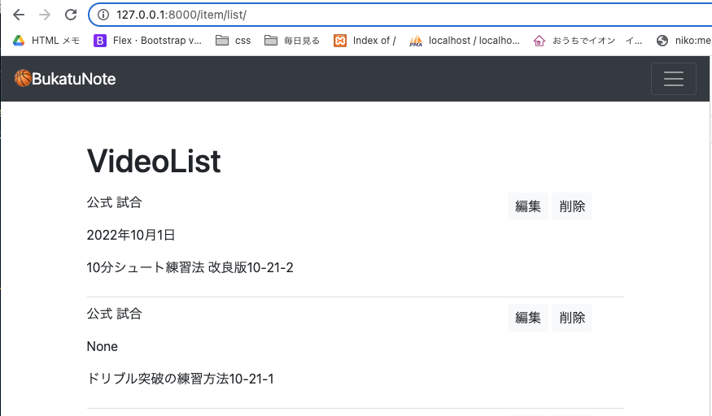
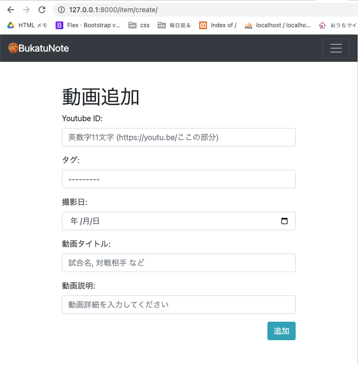
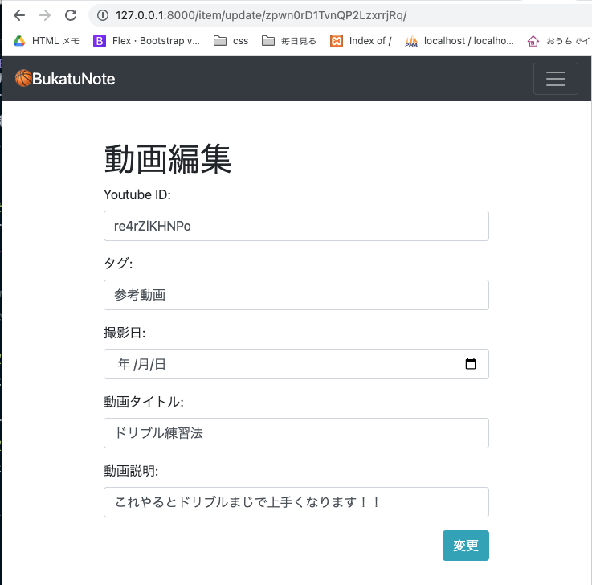

<!-- omit in toc -->
# 動画ItemのList、Update、 Deleteの作成
Createは以前作っていたので、List、Update、Deleteの機能を作っていく

- [config/urls.py](#configurlspy)
- [views](#views)
  - [base/views/item_views.py](#baseviewsitem_viewspy)
- [templates](#templates)
  - [templates/pages/item_list.html](#templatespagesitem_listhtml)
  - [templates/pages/item_create.html(CreateとUpdateをrequest.pathで出し分ける)](#templatespagesitem_createhtmlcreateとupdateをrequestpathで出し分ける)
  - [templates/pages/item_delete.html](#templatespagesitem_deletehtml)

<br><br>

# config/urls.py
```python
from django.contrib import admin
from django.urls import path
from base import views
from django.contrib.auth.views import LogoutView # 追加 viewは自作せずdjangoの機能を使う

urlpatterns = [
    path('admin/', admin.site.urls),

    path('', views.IndexListView.as_view()),  # トップページ
    path('everyone/', views.EveryoneCommentListView.as_view()),  # 自分のコメントページ
    path('items/<str:pk>/', views.ItemDetailView.as_view(), name="item_detail"),
    path('tags/<str:pk>/', views.TagListView.as_view()), # 選択タグの動画表示
    path('comment/', views.CommentListView.as_view(), name="comment"),  # 自分のコメントページ

    # 動画のCRUD
    path('item/list/', views.ItemListView.as_view(), name="item_list"),  # 動画一覧(作業用)ページ
    path('item/create/', views.ItemCreateView.as_view(), name="item_create"),  # 動画投稿ページ
    path('item/update/<str:pk>/', views.ItemUpdateView.as_view(), ),  # 動画編集(作業用)ページ
    path('item/delete/<str:pk>/', views.ItemDeleteView.as_view(), ),  # 動画削除(作業用)ページ

    # Account 追加
    path('login/', views.Login.as_view()),
    path('logout/', LogoutView.as_view()),
    path('signup/', views.SignUpView.as_view()),
    path('account/', views.AccountUpdateView.as_view()),
    path('profile/', views.ProfileUpdateView.as_view()),
]
```

<br><br>

# views
## base/views/item_views.py
- ItemCreateViewクラスは以前作ったもの
- ItemCreateView, ItemUpdateViewは同じテンプレートを使う。ヘッダーや送信ボタンをリクエストによって出し分ける

```python
from django.views.generic import ListView, DetailView, CreateView, UpdateView, DeleteView


#動画一覧画面
class ItemListView(LoginRequiredMixin, ListView):
    model = Item
    #レコード情報をテンプレートに渡すオブジェクト
    context_object_name = "item_list"
    template_name = 'pages/item_list.html'

    def get_queryset(self):
        # アップデート順に表示 新しいのが上
        return Item.objects.filter().order_by('-updated_at')


# 動画登録画面
class ItemCreateView(LoginRequiredMixin, CreateView):
    model = Item
    template_name = 'pages/item_create.html'
    form_class = ItemCreateForm

    # form_valid関数をオーバーライドすることで、更新するフィールドと値を指定できる
    def form_valid(self, form):
        item = form.save(commit=False)
        item.author = self.request.user
        item.save()
        return HttpResponseRedirect(reverse('item_list'))


#編集画面
class ItemUpdateView(LoginRequiredMixin, UpdateView):
    model = Item
    template_name = 'pages/item_create.html'
    form_class = ItemCreateForm
    success_url = reverse_lazy('item_list') # 更新後のページを返す


#削除画面
class ItemDeleteView(LoginRequiredMixin, DeleteView):
    model = Item
    template_name = 'pages/item_delete.html'
    # fields  = ('youtube_url', 'tag', 'shooting_date', 'title', 'description')
    success_url = reverse_lazy('item_list') #削除後のリダイレクト先
```

<br><br>

# templates
## templates/pages/item_list.html

```html




<div class="container my-5">
  <div class="col-12">
    <h1>VideoList</h1>
    <ol class="list-group list-group-numbered">
      
      <div class="detail_comment_list py-2">
        <div class="row">

          <div class="col-9">
            <p>{{item.tag}}</p>
            <p>{{item.shooting_date}}</p>
          </div>
          <div class="col-3">
            <a href="/item/update/{{item.pk}}/">
              <button type="button" class="btn btn-light btn-sm fs-6">編集</button>
            </a>
            <a href="/item/delete/{{item.pk}}/">
              <button type="button" class="btn btn-light btn-sm fs-6">削除</button>
            </a>
          </div>
        </div>

        <p>{{item.title}}</p>
      </div>
      
    </ol>
  </div>
</div>


```



<br><br>

## templates/pages/item_create.html(CreateとUpdateをrequest.pathで出し分ける)
request.pathの中にcreateがあればCreate、updateがあればUpdateを出し分ける

```html




<div class="container my-5">
  <div class="col-12">
    <h1>
      <!-- 動画追加と編集を出し分ける -->
      <!-- request.pathの中にcreateがあれば... -->
      
      動画追加
      
      動画編集
      
    </h1>

    <form method="POST">
      
      {{form}}

      <!-- 動画追加と編集を出し分ける -->
      <!-- request.pathの中にloginがあれば... -->
      
      <div class="text-right mb-3">
        <button type="submit" class="btn btn-info btm-sm">追加</button>
      </div>
      
      <div class="text-right mb-3">
        <button type="submit" class="btn btn-info btm-sm">変更</button>
      </div>
      

    </form>

  </div>
</div>


```



<br><br>

## templates/pages/item_delete.html
- [参考url: Djangoドキュ DeleteView](https://docs.djangoproject.com/en/4.1/ref/class-based-views/generic-editing/)
- [参考url: フォームに入力できない入力欄を設定する](https://gray-code.com/html_css/setting-cant-enterd-text-to-input-element/)
- 動画リストページの削除ボタンから飛ぶ
- 動画登録画面のブラウザElementsから実際ブラウザに表示されている内容をコピーして作成。
name, idは不要なので、css部分だけを残す
- inputに`disabled`を入れることで、入力変更不可のinputができる

```html




<div class="container my-5">
  <div class="col-12">
    <h1>
      動画削除
    </h1>
    <form method="POST">
      
      <label>Youtube ID:</label>
      <input type="text" class="form-control mb-3  col-md-4" placeholder="{{ object.youtube_url }}" disabled>

      <label>タグ:</label>
      <input type="text" class="form-control mb-3  col-md-4" placeholder="{{ object.tag }}" disabled>

      <label>撮影日:</label>
      <input type="text" class="form-control mb-3  col-md-4" placeholder="{{ object.shooting_date }}" disabled>

      <label>動画タイトル:</label>
      <input type="text" class="form-control mb-3" placeholder="{{ object.title }}" disabled>

      <label>動画説明:</label>
      <textarea rows="3" class="form-control mb-3" placeholder="{{ object.description | linebreaksbr }}" disabled></textarea>

      <div class="text-right mb-3">
        <button type="submit" class="btn btn-danger btm-sm">削除</button>
      </div>
    </form>

  </div>
</div>


```


