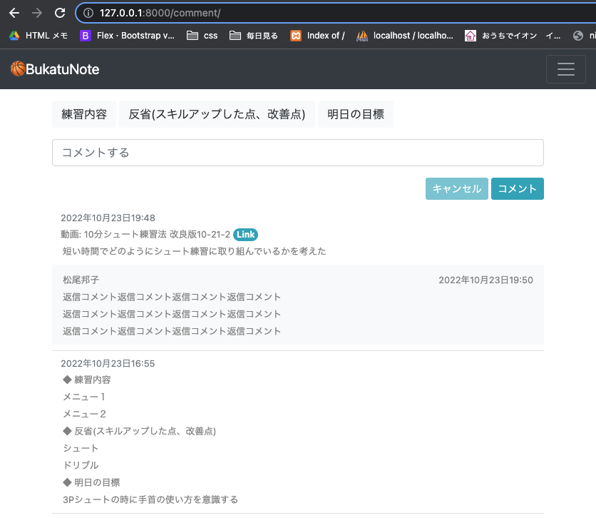

<!-- omit in toc -->
# 07_自分が投稿したコメントだけのページ2
- 自分のコメント紐づいた返信コメントも同時に表示する
- コメントへの返信コメントはグレーになっていて、発言者の名前がある
- 動画に紐づいているコメントは動画へのリンクがついている
- コメント入力の補完機能　押したボタンの内容がtextareaに入っている

<br><br>

- [templates](#templates)
  - [templates/pages/comment.html](#templatespagescommenthtml)
- [Javascript](#javascript)
  - [static/js/script.js](#staticjsscriptjs)
    - [入力補完機能 押したボタンの内容がtextareaに入力される](#入力補完機能-押したボタンの内容がtextareaに入力される)
- [確認](#確認)

<br><br>

# templates
## templates/pages/comment.html
- コメントに対する、返信コメントの一覧を表示部分を追加<br>
``で一つのコメント(object)に紐ついた全ての返信コメントを一つづつ取得する

```html




<div class="container my-2">
  <!-- 入力補完 -->
  <button type="button" class="btn btn-light mt-2" onclick="addText(this);" value="◆ 練習内容">練習内容</button>
  <button type="button" class="btn btn-light mt-2" onclick="addText(this);" value="◆ 反省(スキルアップした点、改善点)">反省(スキルアップした点、改善点)</button>
  <button type="button" class="btn btn-light mt-2" onclick="addText(this);" value="◆ 明日の目標">明日の目標</button>

  <form method="POST">
    
    {{ form }}
    <div class="text-right my-2">
      <button type="submit" class="btn btn-info btn-sm disabled">キャンセル</button>
      <button type="" class="btn btn-info btn-sm">コメント</button>
    </div>
  </form>
</div>

<div class="container my-2">

  <ol class="list-group list-group-numbered">
    
    
    <div class="detail_comment_list py-2">

      <!-- 一つのコメント -->
      <div class="container">
        <div class="row justify-content-between">
          <small class="text-muted mr-4">{{ object.updated_at }}</small>

          <!-- 紐づく動画があれば表示、なければ非表示 -->
          <div id="comment_to_detail_link_box">
            <a href="/items/{{object.target.id}}/">
              <small>動画: </small>
              <small id="comment_to_detail_link">{{ object.target}}</small>
              <span class="badge rounded-pill bg-info">Link</span>
            </a>
          </div>

        </div>
        <small class="mb-1">{{ object.comment_text | linebreaksbr }}</small>
      </div>

      <!-- コメントに対する、返信コメントの一覧を表示 -->
      <div>
        
        <div class="container bg-light mt-2 py-2 reply_box">
          <div class="row">
            <div class="col-auto me-auto">
              <small>{{ reply.author.profile.name }}</small>
            </div>
            <div class="col-auto">
              <small>{{ reply.created_at }}</small>
            </div>
          </div>
          <small>{{ reply.comment_text | linebreaksbr }}</small>
        </div>
        
      </div>

    </div>
    
    
  </ol>
</div>


```

# Javascript
## static/js/script.js
### 入力補完機能 押したボタンの内容がtextareaに入力される
- [参考url: JavaScriptでテキストエリアのカーソル位置に文字を挿入する方法](https://blog.ver001.com/javascript-textarea-selectionstartend/)
```js
// comment.html ボタンの内容のテキストをtextareaのカーソル位置に挿入 ＊＊＊＊＊＊＊＊＊＊＊＊
function addText(e){
	//テキストエリアと挿入する文字列を取得
	var area = document.getElementById('id_comment_text');
  // var btn_value = btn.id; // eleのプロパティとしてidを取得
	var text = e.value;
	//カーソルの位置を基準に前後を分割して、その間に文字列を挿入
	area.value = area.value.substr(0, area.selectionStart)
			+ text
			+ area.value.substr(area.selectionStart);
}
```

# 確認
- 押したボタンの内容がtextareaに入っている
- 動画に紐づいているコメントは動画へのリンクがついている
- コメントへの返信コメントはグレーになっていて、発言者の名前がある
