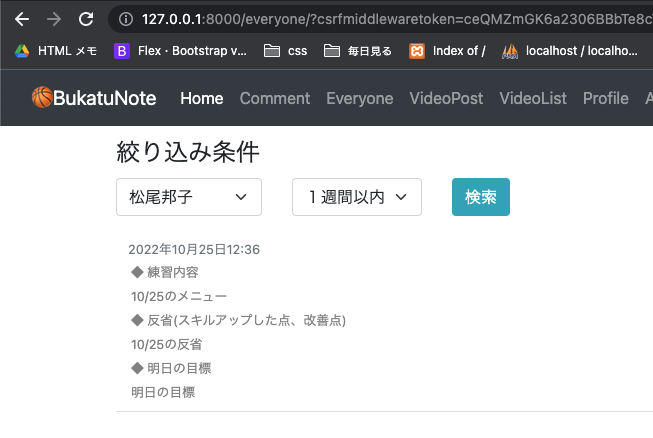

<!-- omit in toc -->
# 19_検索機能の追加 【session機能追加】全員のコメント見れるページ(管理者用everyone_comment.html)
<!-- omit in toc -->
# 機能追加 session機能を使い、データを保持する
名前と日付で検索していくが、名前だけを変えながら（日付指定はそのまま保持）検索を繰り返す時のために、sessionを使う<br>
Django==4.1.1ではsession機能を利用する上で、setings.pyへの追記修正の必要はない<br>
全員のコメントと返信コメントが一覧で見れるページ

ListViewで、オブジェクトをフィルタで表示内容を切り替えできるようにする（今日のコメント、Aさんのコメントなど）
- [参考url: DjangoのListViewで、ページをフィルタしてみた](https://thinkami.hatenablog.com/entry/2016/03/17/003140)

<br>
- [views session](#views-session)
  - [base/views/item_views.py](#baseviewsitem_viewspy)
    - [session](#session)
- [templates](#templates)
  - [templates/pages/everyone_comment.html](#templatespageseveryone_commenthtml)

<br><br>

# views session
## base/views/item_views.py
### session
検索値のリクエストがない場合は、sessionの値を使って検索する
```python
# sessionに値の保存
self.request.session['s_profile_pk'] = 'all_select'
# sessionの呼び出し
context['s_profile_pk'] = self.request.session['s_profile_pk']
```

```python
class EveryoneCommentListView(LoginRequiredMixin, ListView):
    model = Comment
    template_name = 'pages/everyone_comment.html'

    def get_context_data(self, *args, **kwargs):
        context = super().get_context_data(*args, **kwargs)

        # ユーザーの名前を返す(抽出条件select用)
        profiles = Profile.objects.all()
        context['profiles'] = profiles

        # 検索条件の名前の値をsessionに保存する
        if self.request.GET.get('select_profile_pk'):
            profile_pk = self.request.GET.get('select_profile_pk')
            if profile_pk == 'all_select':
                self.request.session['s_profile_pk'] = profile_pk
                self.request.session['s_profile_name'] = 'すべて'
            else:
                profile = Profile.objects.get(pk=profile_pk)
                self.request.session['s_profile_pk'] = profile_pk
                self.request.session['s_profile_name'] = profile.name

        # 検索条件の日付の値をsessionに保存する
        if self.request.GET.get('select_period_key'):
            select_period = self.request.GET.get('select_period_key')
            name_dic = {
                'today_select': '今日',
                'yesterday_select': '昨日',
                'one_week_before': '１週間以内',
                'one_month_before': '１ヶ月以内',
                'one_year_before': '１年以内',
                'all_select': 'すべて',
            }
            self.request.session['s_period_key']= select_period
            self.request.session['s_period']= name_dic[select_period]

        # sessionの値をテンプレートにかえす
        context['s_profile_pk'] = self.request.session['s_profile_pk']
        context['s_profile_name'] = self.request.session['s_profile_name']
        context['s_period_key'] = self.request.session['s_period_key']
        context['s_period'] = self.request.session['s_period']

        return context


    def get_queryset(self):
        # 出力期間を算出する、辞書で呼び出し
        today = datetime.date.today()
        yesterday = today - datetime.timedelta(days=1)
        week = today - datetime.timedelta(weeks=1)
        month = today - relativedelta.relativedelta(months=1)
        year = today - relativedelta.relativedelta(years=1)
        date_dic = {
            'today_select': today, # 今日
            'yesterday_select': yesterday, # 昨日
            'one_week_before': week, # １週間以内
            'one_month_before': month, # １ヶ月以内
            'one_year_before': year, # １年以内
        }

        # sessionにデータがない時は初期設定に'すべて'という文字を指定
        if not 's_profile_pk' in self.request.session:
            self.request.session['s_profile_pk']= 'all_select'
            self.request.session['s_profile_name']= 'すべて'
        if not 's_period_key' in self.request.session:
            self.request.session['s_period_key']= 'all_select'
            self.request.session['s_period']= 'すべて'

        # self.request.GET.get(検索値)がないものは、sessionの値を検索値に入れる
        if self.request.GET.get('select_profile_pk') and self.request.GET.get('select_period_key'):
            q_profile_pk = self.request.GET.get('select_profile_pk')
            q_period_key = self.request.GET.get('select_period_key')
        elif self.request.GET.get('select_profile_pk'):
            q_profile_pk = self.request.GET.get('select_profile_pk')
            q_period_key = self.request.session['s_period_key']
        elif self.request.GET.get('select_period_key'):
            q_profile_pk = self.request.session['s_profile_pk']
            self.request.GET.get('select_period_key')
        else:
            q_profile_pk = self.request.session['s_profile_pk']
            q_period_key = self.request.session['s_period_key']

        # 検索値に応じてobject_listの作成
        if q_profile_pk == 'all_select' and q_period_key == 'all_select' :
            object_list = Comment.objects.all().order_by('-created_at')
        elif q_profile_pk == 'all_select':
            object_list = Comment.objects.filter(created_at__gte=date_dic[q_period_key]).order_by('-created_at')
        elif q_period_key == 'all_select':
            object_list = Comment.objects.filter(author=q_profile_pk).order_by('-created_at')
        else:
            object_list = Comment.objects.filter(author=q_profile_pk, created_at__gte=date_dic[q_period_key]).order_by('-created_at')

        return object_list
```
<!-- - [参考url: 【Django】filter/get/excludeで複数の条件指定やQuerySetを結合する方法](https://qiita.com/NOIZE/items/a50afe3af644a55d37e7)
- [参考url: 【Django】dateField日付範囲検索の方法](https://qiita.com/riecco/items/1f410c2f11ecf54c4a22)
- [参考url: Python で指定時間前（１日前、1年前など）、指定時間後（１日後、1年後）を求める方法](https://leben.mobi/blog/python_date_before_after/python/)
- [参考url: Djangoでサイト内検索機能を追加したメモ](https://qiita.com/yongjugithub/items/07ca78fc882d4ae67386) -->

<br><br>

# templates
## templates/pages/everyone_comment.html
テンプレートの部品化`snippets/comment_box.html`

```html





<div class="container my-2">
  <form method="get" action="">
    
    <legend>絞り込み条件</legend>
    <div class="row">

      <div class="col-auto">
        <select name="select_profile_pk" class="form-select mb-2">
          <option value="{{ s_profile_pk }}" selected="">{{ s_profile_name }}</option>
          <!-- ユーザーの名前だけを表示 -->
          
          <option value="{{ profile.pk }}">{{ profile.name }}</option>
          
          <option value="all_select">すべて</option>
        </select>
      </div>
      <div class="col-auto">
        <select name="select_period_key" class="form-select mb-2">
          <option value="{{ s_period_key }}" selected="">{{ s_period }}</option>
          <option value="today_select">今日</option>
          <option value="yesterday_select">昨日</option>
          <option value="one_week_before">１週間以内</option>
          <option value="one_month_before">１ヶ月以内</option>
          <option value="one_year_before">１年以内</option>
          <option value="all_select">すべて</option>
        </select>
      </div>
      <div class="text-right col-auto">
        <button type="submit" class="btn btn-info btm-sm">検索</button>
      </div>
    </div>

  </form>
</div>


<!-- 全てのコメントの一覧 -->
<div class="container my-2">
  <ol class="list-group list-group-numbered">
    

    <!-- ひとつのコメントとそれに紐づく返信コメントの一覧 -->
    

    
  </ol>
</div>



```



