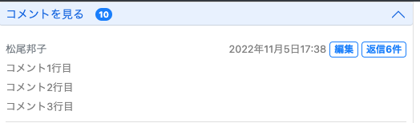

<!-- omit in toc -->
# 20_コメント編集機能-1
# 編集したいコメントの編集ボタンをおしたら、テキストボックスにコメントが入っていて修正できる状態にする




1. 編集ボタンの`onclick="updateCommentText(this);`でjs呼び出し、
2. 編集ボタンの`id="collapse_update_Trigger_{{ comment.pk }}"`を取得、
3. `{{ comment.pk }}`から修正したいコメントを取得
4. 入力フォームのテキストエリアを取得
5. 改行に合わせてテキストエリアのサイズ変更

## html
```html
<!-- 編集ボタンは、ログインユーザーとコメントの登録者が同じ時だけ表示する -->

<button
  type="button"
  id="collapse_update_Trigger_{{ comment.pk }}"
  onclick="updateCommentText(this);">
  編集
</button>



<small class="mb-1" id="get_comment_text_{{ comment.pk }}">
  {{ comment.comment_text | linebreaksbr }}
</small>


<!-- 修正コメントフォーム -->
<form method="POST">
  

  <textarea
    name="update_comment_text"
    id="id_comment_text_{{ comment.pk }}"
    cols="40" rows="1" maxlength="1000" required="" >
  </textarea>
  <input type="hidden" name="update_id" value="{{ comment.pk }}">

  <button
    type="submit"
    name="CommentUpdateFormBtn"
    id="submit_{{ comment.pk }}">
    編集 送信
  </button>
</form>
```

## javascript
```js
function updateCommentText(e){
  // 修正ボタンのidを取得
	var id = e.id; // id="collapse_update_Trigger_{{ comment.pk }}
  var id = id.replace('collapse_update_Trigger_', '');
  console.log(id);
	//テキストエリアを取得
	var area = document.getElementById('id_comment_text_' + id);
  // 修正したいコメントを取得 innerHTML(<br>も含めて取得)
  var update_target = document.getElementById('get_comment_text_' + id)
  // 正規表現で全ての'<br>'を改行の'\n'に置換 (正規表現じゃないと1個目しか置換されなかった)
  var update_text = update_target.innerHTML.replace(/<br>/g, '\n')
  area.value = update_text

  //- 改行に合わせてテキストエリアのサイズ変更
  const PADDING_Y = 20;
  let lineHeight = getComputedStyle(area).lineHeight;
  lineHeight = lineHeight.replace(/[^-\d\.]/g, '');
  const lines = (area.value + '\n').match(/\n/g).length;
  area.style.height = lineHeight * lines + PADDING_Y + 'px';

  // 修正したいコメント非表示
  update_target.style.display ="none";
}
```

- [参考url: 特定の文字列を全て置換する[Javascript]](https://qiita.com/DecoratedKnight/items/103ab57431b6c448e535)