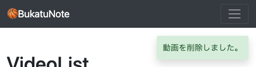

<!-- omit in toc -->
# Djangoのメッセージフレームワークを利用した、通知メッセージを表示する方法
通知メッセージを表示する。3秒後に非表示にする

-[参考url: Djangoドキュ メッセージフレームワーク](https://docs.djangoproject.com/en/4.1/ref/contrib/messages/)
-[参考url: Djangoドキュ(日本語訳) メッセージフレームワーク](https://runebook.dev/ja/docs/django/ref/contrib/messages#django.contrib.messages.get_messages)

<br><br>



- [settings.py](#settingspy)
- [templates](#templates)
  - [templates/snippets/messages.html](#templatessnippetsmessageshtml)
  - [templates/base.html](#templatesbasehtml)
- [views アクション後の処理に合わせてメッセージをかえす](#views-アクション後の処理に合わせてメッセージをかえす)
  - [base/views/account_views.py](#baseviewsaccount_viewspy)
    - [要約](#要約)
    - [DjangoGithub](#djangogithub)
    - [全文](#全文)
- [javascript 2秒後に消える bootstrap toast](#javascript-2秒後に消える-bootstrap-toast)
  - [static/js/script.js](#staticjsscriptjs)
- [git](#git)

<br><br>


# settings.py
```python
+   from django.contrib.messages import constants as messages

+   MESSAGE_TAGS = {
+       messages.DEBUG: 'alert-info',
+       messages.INFO: 'alert-info',
+       messages.SUCCESS: 'alert-success',
+       messages.WARNING: 'alert-warning',
+       messages.ERROR: 'alert-danger',
+   }
```

<br><br>

# templates
## templates/snippets/messages.html
- ``　messageがひとつでも、この書き方をしないといけない。
- `{{ message.tags }}`　viewで決めたsettings.pyの情報が入る(alert-successなど　色が変わる)
- `{{ message }}`　viewで決めたメッセージが表示される
```html


<div
  class="toast-body {{ message.tags }} position-fixed top-5 end-0 m-3 border-0  shadow"
  id="alert"
  style="z-index: 99; border-radius: 4px;">
  {{ message }}
</div>


```

## templates/base.html
base.htmlにincludeするとどこからでも表示できるよね！
```html
    <header>
      
      
      
    </header>

    <!-- メッセージがある時だけ表示される -->
+   

    <main>
      
      
    </main>

```

<br><br>

# views アクション後の処理に合わせてメッセージをかえす
## base/views/account_views.py
### 要約
```python
# インポート
from django.contrib import messages # ここ

# form_validでテンプレートに渡す
def form_valid(self, form):
  # settings.pyのtagの指定、メッセージの指示
    messages.success(self.request, 'ログインしました。')  # ここ
    return super().form_valid(form)

# postを処理する時にテンプレートに渡す
def post(self, request, *args, **kwargs):
    self.object = self.get_object()
    messages.success(self.request, 'アカウントを更新しました。')  # ここ
    return super().post(request, *args, **kwargs)
```
UpdateViewではpost関数で渡している（参考DjangoGithub）

### DjangoGithub
```python
# Django
class BaseUpdateView(ModelFormMixin, ProcessFormView):
    """
    既存のオブジェクトを更新するためのベースビューです。
    この基底クラスを使用するには、レスポンスミクシンを提供するためのサブクラス化が必要です。
    """

    def get(self, request, *args, **kwargs):
        self.object = self.get_object()
        return super().get(request, *args, **kwargs)

    def post(self, request, *args, **kwargs):
        self.object = self.get_object()
        return super().post(request, *args, **kwargs)


class UpdateView(SingleObjectTemplateResponseMixin, BaseUpdateView):
    """テンプレートによってレンダリングされたレスポンスで、オブジェクトを更新するためのビュー"""

    template_name_suffix = "_form"
```

### 全文
```python
    from django.views.generic import CreateView, UpdateView
    from django.contrib.auth.views import LoginView
    from django.contrib.auth.mixins import LoginRequiredMixin # ログインしている人だけ
    from django.contrib.auth import get_user_model
    from base.models import Profile
    from base.forms import UserCreationForm, ProfileCreateForm
+   from django.contrib import messages


    class SignUpView(CreateView):
        form_class = UserCreationForm
        success_url = '/login/'
        template_name = 'pages/login_signup.html'

        def form_valid(self, form):
+           messages.success(self.request, '新規登録が完了しました。続けてログインしてください。')
            return super().form_valid(form)

    class Login(LoginView):
        template_name = 'pages/login_signup.html'

        def form_valid(self, form):
+           messages.success(self.request, 'ログインしました。')
            return super().form_valid(form)

        def form_invalid(self, form):
+           messages.error(self.request, 'エラーでログインできません。')
            return super().form_invalid(form)

    # ログインしている人だけが開けるページ
    # login_requiredはdefのときに使うので
    # 今回は、クラス用のLoginRequiredMixinを使う
    class AccountUpdateView(LoginRequiredMixin, UpdateView):
        model = get_user_model()
        template_name = 'pages/account.html'
        fields = ('username', 'email', )
        success_url = '/account/' # 更新後も同じページを返す

        def get_object(self):
            # URL変数ではなく、現在のユーザーから直接pkを取得
            self.kwargs['pk'] = self.request.user.pk
            return super().get_object()

+       def post(self, request, *args, **kwargs):
+           self.object = self.get_object()
+           messages.success(self.request, 'アカウントを更新しました。')
+           return super().post(request, *args, **kwargs)

    class ProfileUpdateView(LoginRequiredMixin, UpdateView):
        model = Profile
        template_name = 'pages/profile.html'
        form_class = ProfileCreateForm
        # fields = ('name', 'tel', 'birth_day')
        success_url = '/profile/'

        def get_object(self):
            # URL変数ではなく、現在のユーザーから直接pkを取得
            self.kwargs['pk'] = self.request.user.pk
            return super().get_object()

+       def post(self, request, *args, **kwargs):
+           self.object = self.get_object()
+           messages.success(self.request, 'プロフィールを更新しました。')
+           return super().post(request, *args, **kwargs)
```

<br><br>

# javascript 2秒後に消える bootstrap toast
## static/js/script.js
- `if (document.getElementById('alert') != null)`　もしid="alert"があったら
- `window.setTimeout(dispMsg, 5000);`　dispMsg関数を5秒後(5000)に実行する
- `dispMsg`関数　id="alert"を非表示にする

```js
// 3秒後に消えるbootstrap toast Message ＊＊＊＊＊
if (document.getElementById('alert') != null) {
  console.log('alertあります');
  window.setTimeout(dispMsg, 3000);
}
function dispMsg(){
  let alert = document.getElementById('alert');
  alert.style.display ="none";
}
```

- [参考url: 指定時間経過後に1回実行する(window.setTimeout)](https://www.javadrive.jp/javascript/webpage/index4.html)

<br>

# git
git commit -m"messages add"