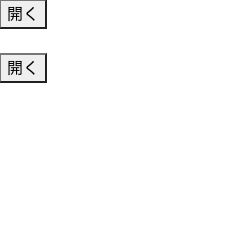
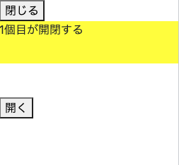
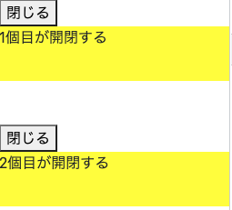

<!-- omit in toc -->
# アコーディオンをJavascriptで実装
Bootstrapでアコーディオンを作っていたけど、機能を追加したいので、JSで実装する
開くをクリックしたら、対象が開いて、ボタンの表示が変わる






<br><br>

- [HTML](#html)
- [CSS](#css)
- [Javascript](#javascript)

<br><br>

# HTML
```html
  <button type="button" id="q1" onclick="openQuestion(1);">開く</button>
  <div class="ans" id="a1">1個目が開閉する</div>

  <br>

  <button type="button" id="q2" onclick="openQuestion(2);">開く</button>
  <div class="ans" id="a2">2個目が開閉する</div>
```

<br><br>

# CSS
初期設定は閉じている
```css
.ans {
  display: none;
  height: 60px;
  background-color: yellow;
}
```

<br><br>


# Javascript
```js
function openQuestion(num) {
  console.log(num);
  var status = document.getElementById("q" + num).textContent;
  if (status == "開く") {
    document.getElementById("q" + num).textContent = "閉じる";
    document.getElementById("a" + num).style.display = "block";
  }
  if (status == "閉じる") {
    document.getElementById("q" + num).textContent = "開く";
    document.getElementById("a" + num).style.display = "none";
  }
}
```
